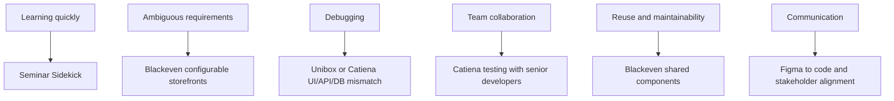

# Rishita Behavioral Story Bank

This file turns your background into reusable behavioral stories.

Why this matters:

- behavioral interviews are often less about the exact event and more about whether you can explain your thinking clearly
- one story can answer many different questions if you know how to adapt it

## 1. How To Use This File

For each story, practice three versions:

1. 20-second version
2. 60-second version
3. 90-second version

Also practice saying:

- what the challenge was
- what you specifically did
- what the result was
- what you learned

## 2. Story Map

## 3. Story: Learning Something New Quickly

Best fit prompts:

- Tell me about a time you had to learn something quickly.
- Tell me about a time you worked outside your comfort zone.
- How do you handle unfamiliar technology?

Best source story:

- Seminar Sidekick

Situation:

You were building a project that combined Next.js, PostgreSQL, Prisma, OpenAI API usage, PDF parsing, chunking, and RAG workflow ideas.

Task:

You had to connect several unfamiliar parts into one coherent full-stack application.

Action:

- broke the project into smaller stages
- validated each stage separately
- connected upload, parsing, retrieval, and answer generation incrementally
- used the project to deepen both theory and practical implementation

Result:

- built a working full-stack project
- improved understanding of retrieval workflows and full-stack coordination
- proved ability to learn fast under complexity

30-second version:

"A good example was Seminar Sidekick. It required me to combine Next.js, PostgreSQL, Prisma, PDF processing, and RAG-related ideas in one project. I broke the work into smaller stages, validated each stage separately, and then connected them end to end. That helped me learn quickly without getting overwhelmed, and it also improved my confidence in handling unfamiliar technical areas."

What skill this proves:

- learning speed
- structured thinking
- persistence

Trap to avoid:

- do not make it sound like you randomly glued tools together without understanding them

## 4. Story: Turning Requirements Into Reusable Components

Best fit prompts:

- Tell me about a time requirements were unclear.
- Tell me about a time you collaborated with non-engineers.
- Tell me about a time you improved consistency.

Best source story:

- Blackeven custom storefront requirements into configurable components

Situation:

Different client storefronts needed different branding and content needs, but the team still wanted consistency and reuse.

Task:

Help turn custom needs into configurable reusable component patterns instead of making every storefront completely custom.

Action:

- collaborated with design and product stakeholders
- identified what should vary by client and what should stay shared
- built configurable components and reusable sections

Result:

- faster site creation
- more consistency across storefronts
- maintained client branding without total duplication

30-second version:

"At Blackeven, client storefronts needed customization, but we still needed consistency and reuse. I worked with design and product stakeholders to identify what should be configurable versus shared, then translated that into reusable storefront components and sections. That helped preserve branding while improving consistency and maintainability."

What skill this proves:

- communication
- reusable design thinking
- handling ambiguity

Trap to avoid:

- do not imply you alone defined the product strategy for all tenants

## 5. Story: Debugging Across The Stack

Best fit prompts:

- Tell me about a difficult bug.
- Tell me about a time you solved a problem methodically.
- How do you troubleshoot issues?

Best source story:

- Unibox or Catiena mismatch between UI, API, and database records

Situation:

The UI behavior and backend-backed data were not consistent.

Task:

Find where the mismatch originated and fix it without guessing.

Action:

- checked frontend state and payload
- checked network request and response
- inspected backend logic and stored data shape
- narrowed the issue to the actual failing layer

Result:

- improved consistency between UI actions, backend results, and reports
- strengthened confidence in end-to-end debugging

30-second version:

"A strong example is the debugging work I did in dashboard and portal projects. When UI behavior and backend-backed data did not match, I traced the issue layer by layer by checking component state, the network request, the backend response, and the stored record shape. That helped identify the real source of the mismatch instead of making random fixes."

What skill this proves:

- debugging
- calm problem solving
- systems thinking

Trap to avoid:

- do not tell the story as if debugging was just guessing and trying random changes

## 6. Story: Working With Senior Developers On Quality And Auth Flows

Best fit prompts:

- Tell me about a time you worked closely with teammates.
- Tell me about a time you received feedback.
- Tell me about a time you improved quality.

Best source story:

- Catiena testing of login-protected flows with senior developers

Situation:

The onboarding portal had authenticated flows and form interactions that needed to behave correctly.

Task:

Work with senior developers to test flows, document fixes, and keep behavior aligned with requirements.

Action:

- tested login-protected user flows
- validated form behavior and dashboard interactions
- documented issues and fixes clearly
- aligned implementation with expected behavior

Result:

- more reliable user flow behavior
- better collaboration with senior developers
- more disciplined understanding of quality checks

30-second version:

"At Catiena, I worked with senior developers to test login-protected flows, form validation, and dashboard behavior. My role included checking how the UI behaved under authenticated scenarios, documenting issues, and helping keep the implementation aligned with expected requirements. That improved both quality and my ability to collaborate effectively with more experienced teammates."

What skill this proves:

- teamwork
- feedback acceptance
- quality mindset

Trap to avoid:

- do not make it sound like you only watched other people test

## 7. Story: Building Reusable UI From Design Files

Best fit prompts:

- Tell me about a time you improved maintainability.
- Tell me about a time you translated requirements into implementation.
- What kind of frontend work are you best at?

Best source story:

- Unibox or Catiena Figma-to-code implementation

Situation:

You had to turn design files into real application screens that stayed consistent and responsive.

Task:

Create reusable components, forms, filters, and layouts rather than one-off screens.

Action:

- translated Figma screens into React components
- reused patterns across cards, forms, filters, and list/detail pages
- kept responsiveness and consistency in mind

Result:

- faster implementation of new screens
- improved UI consistency
- stronger reusable component library thinking

30-second version:

"In both Unibox and Catiena, I converted Figma designs into reusable React components and layouts instead of building every screen as a one-off. That included forms, filters, cards, and responsive page patterns, which improved both speed and UI consistency."

What skill this proves:

- frontend implementation strength
- maintainability
- responsive UI thinking

Trap to avoid:

- do not reduce the story to only visual styling; mention reuse and maintainability

## 8. Story: Owning A Full-Stack Project Independently

Best fit prompts:

- Tell me about a project you are proud of.
- Tell me about a time you owned something end to end.
- Tell me about a technically challenging project.

Best source story:

- Seminar Sidekick

Situation:

You wanted to build a project that combined modern full-stack web development with source-grounded question answering over documents.

Task:

Design and implement the application from upload through retrieval and response generation.

Action:

- designed data models
- built document upload and parsing flow
- implemented retrieval and response logic
- used Next.js, PostgreSQL, and Prisma together

Result:

- delivered a complete project that demonstrates full-stack ownership
- strengthened project explanation skills

30-second version:

"Seminar Sidekick is one of the projects I am most proud of because it let me own the full flow from UI to backend logic to data modeling. It combined document upload, parsing, retrieval, and grounded answer generation in one application, and it gave me strong practice in building and explaining a real full-stack system."

What skill this proves:

- ownership
- learning ability
- architectural thinking at project scale

Trap to avoid:

- do not turn it into only an AI buzzword story; keep the product flow clear

## 9. Story: Handling A Technology Gap Honestly

Best fit prompts:

- Tell me about a weakness.
- How do you deal with technologies you do not know deeply yet?
- How do you approach a mixed-stack role?

Best source story:

- your honest C# positioning

Situation:

The role includes C#, but your strongest depth is in React, Next.js, and JavaScript full-stack work.

Task:

Present this honestly without sounding weak or defensive.

Action:

- positioned React and Next.js as immediate value area
- explained that backend concepts transfer across Node.js and C#
- framed C# as lighter but real exposure with willingness to ramp

Result:

- preserves credibility
- shows coachability and adaptability

30-second version:

"My strongest depth today is in React, Next.js, and JavaScript full-stack work, so I do not want to overstate C# experience. At the same time, I am comfortable with backend concepts like routing, validation, services, and data access, so I can contribute in a mixed-stack environment while continuing to ramp in .NET."

What skill this proves:

- honesty
- maturity
- adaptability

Trap to avoid:

- do not apologize excessively for not being a pure .NET specialist

## 10. Story: Balancing Academic Work With Practical Building

Best fit prompts:

- How did you stay current while studying?
- How do you manage multiple priorities?
- What have you been doing recently?

Best source story:

- Rutgers Master's plus recent projects

Situation:

After your full-time roles, you moved into graduate school.

Task:

Keep growing technically while balancing academic work.

Action:

- maintained strong GPA
- built practical projects like Seminar Sidekick and QueueWise
- kept full-stack learning active

Result:

- did not drift away from technical work
- strengthened both fundamentals and applied skills

30-second version:

"Since starting my Master's, I have focused on strengthening both fundamentals and practical skills. I maintained a strong GPA while also building projects like Seminar Sidekick and QueueWise, so I stayed hands-on rather than becoming only academic."

What skill this proves:

- discipline
- consistency
- self-direction

Trap to avoid:

- do not describe school and projects as unrelated tracks

## 11. Story Adaptation Table

| If they ask about... | Use this story |
| --- | --- |
| learning quickly | Seminar Sidekick |
| ambiguous requirements | Blackeven configurable storefronts |
| debugging | Unibox or Catiena cross-layer bug tracing |
| teamwork | Catiena testing with senior developers |
| maintainability | Blackeven shared components or Figma-to-code reuse |
| ownership | Seminar Sidekick |
| weakness | C# honesty and ramp-up mindset |
| recent experience | Rutgers plus projects |

## 12. Final Behavioral Reminder

Do not answer behavioral questions like a robot reading STAR headings.

Instead:

- explain the situation naturally
- make your action concrete
- keep the result believable
- say what you learned

That will sound much more mature than a memorized template.