# Rishita Mane Full-Stack Interview Master Guide

This guide is built around your current resume and the prep documents already in this folder. The goal is not to make you sound memorized. The goal is to help you understand the concepts in simple language, explain your projects clearly, and survive follow-up questions without panicking.

No finite document can literally list every possible interview question because interviewers can phrase the same concept in infinitely many ways. So this guide is designed to cover the underlying concept families, the common question variations for each family, and the follow-up chains that usually come after the first question.

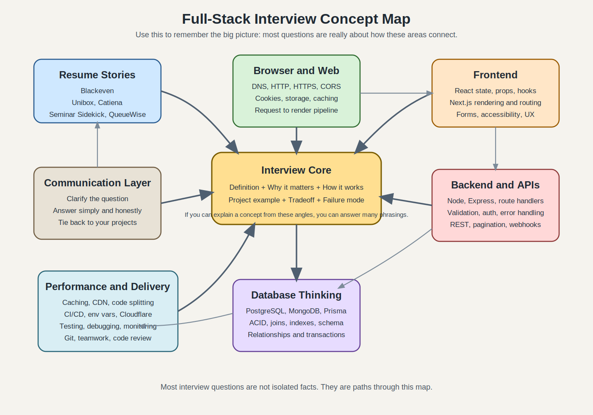

Use the markdown preview if you want a visual overview before reading section by section.

## 1. What Interviewers Are Usually Testing

Interviewers are usually not only checking whether you know a definition. They are checking whether:

- you actually understand the words on your resume
- you can explain your own work in plain English
- you know how frontend, backend, APIs, and databases connect together
- you can answer follow-up questions without contradicting yourself
- you are honest about what you did directly vs what the team or seniors handled
- you stay calm when you do not know something exactly

The strongest mindset for you is this:

- do not try to sound like a senior architect if that is not your real experience
- do try to sound like a thoughtful full-stack developer who understands the end-to-end flow
- always connect definitions to one of your actual projects or jobs

## 2. The Best Way To Answer Any Technical Question

Use this formula almost every time:

1. Give the simple definition.
2. Say why it matters.
3. Give one example from your work.

Example:

**Question:** What is an API?

**Strong answer:**

"An API is a contract that lets one piece of software talk to another in a structured way. In web apps, the frontend usually sends a request to an API to fetch or save data. It matters because it separates the UI from the backend logic and database. In my dashboard and portal work, the React frontend called REST API endpoints to create, update, search, and display records."

That answer works because it has definition, importance, and project example.

## 3. What To Say When You Are Nervous, Confused, Or Do Not Know

### If you do not understand the question

Use one of these:

- "Could you rephrase that once? I want to answer the exact thing you are asking."
- "Are you asking at the concept level, or in the context of one of my projects?"
- "I know the topic, but I want to answer from the right angle. Do you want the simple explanation or the project-specific explanation?"

### If you only know part of the answer

- "I have used it in practice more than I have configured it from scratch, but I can explain how it worked in my project."
- "I know the basic idea and how it fits into the flow. I have not worked on the deepest implementation details myself."

### If you do not know the answer

- "I do not want to bluff. I have not worked deeply with that specific part yet. My current understanding is..."
- "I have not used that directly, but based on what I know, I would expect it to work like..."
- "I am not fully sure on that detail. I would usually verify it in docs or by checking the implementation before giving a final answer."

### What not to say

- "I do not know anything about that."
- "I just copied the code."
- "My senior handled all of that."
- "I forgot everything."

Better version:

- "I was not the main owner of that setup, but I worked with it and I can explain the part I interacted with."

## 4. Your Core Interview Story

### 30-second introduction

"I am a full-stack developer with stronger day-to-day experience on the frontend, especially React and Next.js, but I have also worked across Node.js, Express, MongoDB, PostgreSQL, and Prisma to support end-to-end features. My industry experience includes e-commerce storefronts, internal dashboards, and client portals, and my recent academic work includes Seminar Sidekick, a Next.js project using OpenAI, RAG workflows, PostgreSQL, and Prisma. I am strongest when I can trace the full flow from UI interaction to API to database and debug issues across that whole path."

### 90-second introduction

"I have worked across frontend and backend, with my strongest practical experience in React and Next.js. At Blackeven Ventures I worked on a multi-tenant e-commerce website builder where we created reusable storefront components, connected product and catalog data to the frontend, and supported Cloudflare-based deployments. At Unibox and Catiena I worked on dashboards and client portals using React, Node.js, Express, and MongoDB-style CRUD workflows. More recently, during my Master's at Rutgers, I built projects like Seminar Sidekick, where I used Next.js, PostgreSQL, Prisma, OpenAI, PDF processing, chunking, and retrieval workflows. So while I am still growing, I can talk clearly about the full flow of modern web applications from user action to data storage and back to the UI."

### If asked whether you are stronger on frontend or backend

Best answer:

"I am stronger on the frontend because most of my day-to-day work has been in React and Next.js, building reusable components, forms, dashboards, and storefront pages. But I have also worked with backend routes, validation logic, REST APIs, MongoDB, PostgreSQL, and Prisma, so I understand the end-to-end flow well."

### If asked what you have been doing since December 2023

Best answer:

"Since then I have been focused on my Master's at Rutgers, where I maintained a strong GPA and built projects that kept me hands-on with full-stack development, especially Seminar Sidekick and QueueWise. So I was not away from tech; I was deepening both academic and practical experience."

## 5. Safe Resume Positioning: What To Claim Strongly And What To Phrase Carefully

### Strong claims you can safely make

- React and Next.js component development
- reusable UI components
- forms, filters, tables, dashboards, and portal screens
- REST API usage from frontend to backend
- basic backend route logic and validation
- MongoDB and PostgreSQL at application level
- Prisma for data modeling and CRUD access
- end-to-end debugging across UI, API, and data
- Figma-to-code implementation
- RAG project concepts in Seminar Sidekick

### Claims to phrase carefully so you do not overstate

- **Monorepo workflows:** say you worked inside a monorepo with shared packages and shared code, not that you designed the full monorepo tooling unless that is true.
- **Microservice-oriented architecture:** say you worked in a system organized around services and integrations, not that you designed the entire architecture yourself unless that is true.
- **Cloudflare deployment:** say you supported Cloudflare-based deployment workflows and understood why they helped, not that you built the whole infrastructure from scratch unless that is true.
- **C#:** say you used basic utility and validation logic and are not presenting yourself as a primary C# backend specialist.
- **AWS/GCP/Azure fundamentals:** say you have foundational familiarity, not deep production ownership.
- **Django:** only go deeper if you are comfortable. If not, call it exposure rather than core production experience.

This matters because many interviews are won or lost in follow-up questions.

## 6. The Most Important Mental Model: How Data Moves In A Full-Stack App

If they ask anything like:

- How does an API work?
- How does user input reach the database?
- What happens after form submit?
- What is happening between frontend and backend?

you should be able to explain this full path.

```mermaid
flowchart LR
    A[User types first name] --> B[React or Next.js input state]
    B --> C[Submit handler]
    C --> D[HTTP request to API]
    D --> E[Backend route or handler]
    E --> F[Validation and auth checks]
    F --> G[Business logic]
    G --> H[Prisma or database query]
    H --> I[(MongoDB or PostgreSQL)]
    I --> J[API response]
    J --> K[Frontend updates UI]
```

### Plain-English explanation

1. The user types into an input on the page.
2. React usually stores that value in component state.
3. When the user clicks submit, a function runs.
4. The frontend may do basic validation first, like checking that the field is not empty.
5. The frontend sends an HTTP request to an API endpoint.
6. The backend receives the request.
7. Backend code validates the data again because frontend validation alone is not enough.
8. The backend runs any business logic.
9. The backend uses a query or ORM like Prisma to write data to the database.
10. The database saves it and returns a result.
11. The backend sends a response back, usually JSON.
12. The frontend reads the response and updates the UI, such as showing success, error, or the new saved record.

### Simple answer you can say in an interview

"If a user enters a first name in a form, React captures that value and stores it in state. On submit, the frontend sends a POST or PUT request to an API endpoint with the data in JSON format. The backend route receives it, validates it, applies business logic, and then writes it to the database using queries or an ORM like Prisma. After the database responds, the API returns success or error data to the frontend, and the UI updates accordingly."

### What lives on the client vs server

- **Client:** the browser, UI, buttons, forms, state, rendering, user interactions
- **Server:** routes, validation, auth checks, secure business logic, access to secrets, database operations
- **Database:** persistent storage for records, users, products, workflows, reports, and metadata

### Why validation should happen in both places

- **Frontend validation:** improves user experience by catching simple mistakes early
- **Backend validation:** protects the system because anyone can bypass frontend code

## 7. Web, Browser, And API Fundamentals

### What is an API?

- Plain meaning: an API is a set of rules for communication between systems.
- Web app meaning: the frontend sends requests to a backend API to fetch or save data.
- Why it matters: it separates UI from backend logic and storage.

Good answer:

"An API is the interface that lets the frontend and backend communicate. In my projects, the UI would call REST endpoints to fetch data for tables or submit forms, and the backend would validate the input, access the database, and return JSON back to the UI."

### Request and response

A request usually contains:

- method: GET, POST, PUT, PATCH, DELETE
- URL: where the request goes
- headers: extra info like content type or auth token
- body: data being sent, often JSON

A response usually contains:

- status code: 200, 201, 400, 401, 404, 500, and so on
- headers
- body: returned data or error message

### CRUD and HTTP methods

- **Create** -> POST
- **Read** -> GET
- **Update** -> PUT or PATCH
- **Delete** -> DELETE

### PUT vs PATCH

- **PUT:** usually replaces the full resource
- **PATCH:** partially updates only some fields

Simple answer:

"I think of PUT as replacing a record with a new full version, while PATCH is for changing only the fields that need updating."

### What is REST?

REST is a common style for designing APIs around resources and standard HTTP methods.

Example:

- `GET /users/5`
- `POST /users`
- `PATCH /users/5`
- `DELETE /users/5`

Good answer:

"REST is a way of designing APIs where resources are identified by URLs and manipulated using standard HTTP methods like GET, POST, PATCH, and DELETE."

### JSON

JSON is the common format used to send structured data between frontend and backend.

Example:

```json
{
  "firstName": "Rishita",
  "email": "example@email.com"
}
```

### Common status codes

- `200 OK` - request succeeded
- `201 Created` - new record created successfully
- `400 Bad Request` - invalid input
- `401 Unauthorized` - user is not authenticated
- `403 Forbidden` - user is authenticated but not allowed
- `404 Not Found` - resource does not exist
- `500 Internal Server Error` - server-side problem

### HTTP vs HTTPS

- **HTTP:** plain communication protocol
- **HTTPS:** HTTP plus encryption using TLS

Good answer:

"HTTPS is the secure version of HTTP. It encrypts data in transit so information like login details cannot be read easily if intercepted."

### What is CORS?

CORS stands for Cross-Origin Resource Sharing. It is a browser security rule that controls whether one origin can make requests to another origin.

Simple example:

- frontend runs on `localhost:3000`
- API runs on `localhost:5000`
- browser blocks the request unless the API allows that origin

Good answer:

"CORS is a browser security mechanism. If the frontend and backend are on different origins, the backend must explicitly allow the frontend origin, otherwise the browser blocks the request."

### Cookies vs localStorage vs sessionStorage

- **Cookies:** small data stored by browser; often used for sessions; can be sent automatically with requests
- **localStorage:** stays until cleared; not automatically sent with requests
- **sessionStorage:** lasts for the browser tab session

Security note:

- for auth, httpOnly cookies are often safer than storing tokens in localStorage because JavaScript cannot read httpOnly cookies

### Authentication vs authorization

- **Authentication:** who are you?
- **Authorization:** what are you allowed to do?

Example:

- login verifies identity -> authentication
- checking whether a user can access admin data -> authorization

### What is JWT?

JWT stands for JSON Web Token. It is a signed token that can carry user info like user ID, role, and expiry.

Simple flow:

1. User logs in.
2. Server verifies credentials.
3. Server returns a token.
4. Client sends that token on future requests.
5. Server verifies the token before allowing access.

### What happens when you type a URL and press Enter?

Simple version:

1. Browser looks up the domain using DNS.
2. Browser connects to the server.
3. If HTTPS is used, a secure TLS connection is established.
4. Browser sends an HTTP request.
5. Server processes the request and returns HTML, CSS, JavaScript, or data.
6. Browser renders the page.
7. JavaScript may run and fetch more data.

If Next.js is involved, part of the page may already be rendered on the server before it reaches the browser.

### What is a webhook?

A webhook is when one system automatically sends an HTTP request to another system when an event happens.

Example:

- payment succeeds
- payment provider sends a webhook to your backend
- backend updates order status

## 8. Database Fundamentals You Must Be Able To Explain

### What is a database?

A database is persistent storage for application data.

Examples from your resume:

- products and storefront content
- client records and workflow items
- reports and dashboard data
- uploaded document metadata and retrieval data

### SQL vs NoSQL

- **SQL databases** like PostgreSQL store data in tables with rows and columns and are strong for structured relationships.
- **NoSQL databases** like MongoDB store flexible documents and are useful when data shape changes often or is naturally document-like.

### PostgreSQL vs MongoDB on your resume

Good answer:

"I think of PostgreSQL as better when the data is structured and relationships matter, and MongoDB as useful when the data is more document-shaped or needs schema flexibility. In practice I have worked with both depending on the project."

### What is ACID?

ACID is a set of properties that help database transactions stay reliable.

- **Atomicity:** all steps happen or none happen
- **Consistency:** data stays valid according to rules
- **Isolation:** concurrent operations do not corrupt each other
- **Durability:** once committed, data stays saved even after a crash

Bank transfer example:

- money should not leave one account without reaching the other
- both changes should succeed together or fail together

Good answer:

"ACID describes why relational database transactions are reliable. Atomicity means all or nothing, consistency means valid data, isolation means concurrent operations do not interfere incorrectly, and durability means committed data stays saved."

### What is a transaction?

A transaction groups multiple database operations into one unit.

Use case:

- create order
- reduce inventory
- record payment reference

If one fails, you may want to roll everything back.

### What is an index?

An index is a data structure that helps the database find rows or documents faster.

Good mental model:

- without index: reading a whole book page by page
- with index: jumping to the right page using the table of contents

Tradeoff:

- faster reads
- extra storage
- slower writes sometimes because the index must also be updated

### What is a JOIN?

A join combines related data from multiple tables.

Example:

- `users`
- `orders`

Join lets you see which orders belong to which users.

### INNER JOIN vs LEFT JOIN

- **INNER JOIN:** only matching rows from both tables
- **LEFT JOIN:** all rows from left table, plus matches from right table if present

### What is normalization?

Normalization means structuring data to reduce duplication.

Example:

- instead of storing the same client address inside many task rows
- store client info once and reference it

### When might you denormalize?

When performance or read simplicity matters more than perfect normalization.

### What is Prisma ORM?

Prisma is an ORM. ORM means Object Relational Mapper.

It lets you work with database records using code instead of writing raw SQL every time.

Good answer:

"Prisma sits between application code and PostgreSQL. It gives typed models and cleaner CRUD operations, which made it easier to work with schema-defined data in my Seminar Sidekick project."

### What is a schema?

A schema describes the structure of your data.

For SQL this often means:

- tables
- columns
- data types
- primary keys
- foreign keys
- relationships

For MongoDB it is more flexible, but teams often still enforce structure at the application level.

## 9. React Fundamentals You Must Know Clearly

### What is React?

React is a JavaScript library for building user interfaces from reusable components.

### What is a component?

A component is a reusable piece of UI.

Examples from your work:

- product card
- hero banner
- header
- footer
- dashboard card
- filter bar
- table row
- status badge

### Props vs state

- **Props:** data passed into a component from its parent
- **State:** data a component manages itself and can update over time

Simple answer:

"Props come from outside the component. State is owned by the component. When state changes, React re-renders the UI."

### What is JSX?

JSX lets you write UI-like syntax inside JavaScript.

### What is re-rendering?

When props or state change, React runs the component again to figure out what the UI should look like now.

### What is the Virtual DOM?

The Virtual DOM is a lightweight in-memory representation of the UI. React compares the new version with the previous version and updates only what changed in the real DOM.

### What are hooks?

Hooks are functions that let functional components use state and other React features.

The most important ones for interviews:

- `useState` - local state
- `useEffect` - side effects like data fetching, subscriptions, timers
- `useContext` - shared state without passing props through many layers
- `useRef` - mutable value or DOM reference without re-rendering
- `useMemo` - memoize expensive computed values
- `useCallback` - memoize function references

### `useEffect` dependency rules

- no dependency array -> runs after every render
- empty array `[]` -> runs once after initial mount
- `[value]` -> runs after mount and whenever `value` changes

### Controlled components

A controlled input is an input whose value comes from React state.

This is common for forms because it makes validation and submission easier.

### What is prop drilling?

Prop drilling means passing data through many intermediate components just to reach a deep child.

Common solutions:

- Context API
- state management library
- better component composition

### What is Context API?

Context lets you share data across a component tree without manually passing props through every layer.

Good use cases:

- theme
- auth state
- language
- lightweight shared app state

### How to prevent unnecessary re-renders

- `React.memo`
- `useMemo`
- `useCallback`
- keep state at the right level
- avoid creating new objects and functions unnecessarily when not needed

## 10. Next.js Fundamentals In Simple Language

### What is Next.js?

Next.js is a React framework. React gives you UI building blocks. Next.js adds routing, server-side capabilities, rendering strategies, API routes, and production-friendly structure.

### React vs Next.js

- **React:** UI library
- **Next.js:** framework built on React for full web apps

### Why companies use Next.js

- file-based routing
- server-side rendering options
- better SEO support
- API routes or route handlers
- easier production setup

### What is SSR, SSG, and ISR?

- **SSR (Server-Side Rendering):** page rendered on each request
- **SSG (Static Site Generation):** page built ahead of time
- **ISR (Incremental Static Regeneration):** static page that can refresh periodically in the background

Simple answer:

"SSR is for fresher per-request data, SSG is for pages that can be built ahead of time, and ISR is a mix where static pages can be regenerated after some interval."

### Pages Router vs App Router

- **Pages Router:** older Next.js style using the `pages` directory
- **App Router:** newer style using the `app` directory with server components and nested layouts

If asked what you used, answer honestly based on the project. If you mainly used the older model in real work, say that and then explain that you understand the newer App Router conceptually.

### Server Components vs Client Components

- **Server Components:** run on the server; good for data fetching and reducing client JavaScript
- **Client Components:** run in the browser; needed for interactivity, state, and browser APIs

Easy rule:

- if it needs `useState`, `useEffect`, click handlers, or browser-only APIs, it is client-side

### How routing works in Next.js

Next.js uses file-based routing. File structure maps to URLs.

Examples:

- `pages/products.js` -> `/products`
- `pages/products/[id].js` -> dynamic product route

### What are Next.js API routes?

They are backend endpoints inside a Next.js project.

Good answer:

"API routes let you keep simple backend logic inside the same Next.js project. In a project like Seminar Sidekick, that is useful for upload, processing, and retrieval endpoints without needing a separate backend repo for every feature."

### What is middleware in Next.js?

Middleware runs before a request is completed. It is often used for auth checks, redirects, or request handling rules.

### How static storefronts can still use dynamic data

Important answer for Blackeven:

"Static deployment does not mean all data is hardcoded forever. The layout or shell can be static, while product, catalog, or configuration data can still be fetched from APIs at build time, on revalidation, on the server, or on the client depending on the page strategy."

## 11. Node.js And Express Fundamentals

### Node.js vs Express.js

- **Node.js:** JavaScript runtime on the server
- **Express.js:** web framework on top of Node.js for routes and middleware

Simple answer:

"Node.js lets JavaScript run on the server. Express is a framework that makes it easier to build APIs and route requests in Node.js."

### What is middleware in Express?

Middleware is code that runs between the request coming in and the final response going out.

Common middleware tasks:

- parse JSON body
- log requests
- check authentication
- validate input
- handle errors

### What is the event loop?

Node.js is single-threaded in how your JavaScript runs, but it handles many I/O tasks efficiently using an event-driven model. It does not sit and block on every file read or database call.

Simple answer:

"The event loop lets Node handle many I/O-heavy tasks efficiently by not blocking the main execution for each operation."

### Callbacks vs Promises vs async/await

- **Callback:** older style, can become hard to read when nested
- **Promise:** cleaner way to represent future completion
- **async/await:** syntax on top of Promises that makes async code easier to read

### Error handling in Express

Typical pattern:

- use `try/catch` in async logic
- pass errors to centralized error middleware
- return meaningful status codes and messages

### Authentication flow in a backend API

Simple version:

1. user submits login credentials
2. backend verifies them
3. backend creates session or token
4. future requests include that session or token
5. protected routes verify it before returning data

### What are environment variables?

Environment variables store configuration values outside source code.

Examples:

- database URL
- API keys
- secret keys
- deployment settings

Important reason:

- do not hardcode secrets in source code

## 12. TypeScript Basics You Should Be Ready For

### What is TypeScript?

TypeScript is JavaScript plus static types.

Why teams use it:

- catches mistakes earlier
- improves editor autocomplete and maintainability
- makes larger codebases easier to understand

### `type` vs `interface`

Simple answer:

"Both define shapes of data. Interface is often used for object structures and is extendable. Type is more flexible because it can also represent unions, intersections, and aliases."

### `any` vs `unknown`

- **any:** turns off type safety
- **unknown:** value is unknown until you narrow it safely

Better answer:

"`unknown` is safer than `any` because TypeScript forces you to check the value before using it."

### What are generics?

Generics let you write reusable code that works with different types while still preserving type safety.

### What is `Partial<T>`?

It makes all properties of a type optional.

Common use case:

- update payloads where only some fields are sent

## 13. Architecture, Deployment, And Production Basics

### Monolith vs microservices

- **Monolith:** one main application handles many concerns together
- **Microservices:** system split into smaller services with separate responsibilities

### What microservice-oriented architecture means on your resume

Safe answer:

"I worked in an environment where responsibilities were split across services and integrations rather than everything living in one codebase path. My role was mostly on the application and integration side, not designing the entire architecture from scratch."

### Monorepo vs monolith

- **Monorepo:** one repository can contain many apps or packages
- **Monolith:** one application architecture

Important: a monorepo is about repository organization, while a monolith is about system architecture. They are not the same thing.

### Why teams use a monorepo

- shared components
- shared utilities
- easier code reuse
- easier version alignment across related apps

### What is a CDN?

A CDN is a distributed network that serves content from locations closer to users.

Why it matters:

- faster page loads
- lower latency
- better global performance

### What is caching?

Caching means storing previously computed or fetched data so it can be served faster next time.

Examples:

- browser cache
- CDN cache
- server-side cache
- API response cache

### Horizontal vs vertical scaling

- **Vertical scaling:** make one machine stronger
- **Horizontal scaling:** add more machines

### Cloudflare Pages vs Workers

- **Cloudflare Pages:** hosting for frontend sites and static or edge-enabled apps
- **Cloudflare Workers:** serverless code that runs at the edge

### What is CI/CD?

CI/CD means automating integration, testing, and deployment steps so code moves to production more safely and consistently.

## 14. Resume Deep Dive: Blackeven Ventures

### What the role was in simple words

You worked on a multi-tenant e-commerce website builder that let different clients launch branded storefronts using reusable sections and shared components.

### Strong short answer

"At Blackeven I worked on a multi-tenant e-commerce platform where clients could launch storefronts using shared reusable components. My work focused on Next.js storefront pages, reusable React components, connecting product and catalog data to the frontend, and supporting a maintainable setup inside a monorepo-style environment."

### Likely questions and good answers

**What does multi-tenant mean?**

"Multi-tenant means one platform serves multiple clients or brands, but each tenant has its own configuration, branding, and data context. The goal is to reuse shared platform logic while still letting each client have a customized storefront."

**What reusable components did you build?**

"Reusable storefront components like product listings, hero banners, headers, footers, and layout sections. The idea was that clients could compose pages from shared building blocks instead of building every site from scratch."

**How did product data reach the storefront?**

"The frontend pages were connected to backend product and catalog data flows. The page would fetch or receive product data and render the relevant sections dynamically, rather than hardcoding all content."

**What did monorepo workflow mean in practice?**

"There were shared packages and shared UI pieces used across clients, which helped maintain consistency and avoid duplicating the same code across storefronts."

**What did Cloudflare help with?**

"Cloudflare helped with fast frontend delivery through edge distribution and simplified deployment of client-facing storefronts. The main value was better performance and easier publishing of sites."

### Safe boundary answers

If asked which monorepo tool was used and you are not sure:

"I worked inside the shared monorepo structure and shared packages, but I was not the primary owner of the repository tooling setup itself."

If asked whether you designed the whole microservice architecture:

"I worked within that architecture and integrated with it, but I would not claim that I designed the whole platform architecture myself."

## 15. Resume Deep Dive: Unibox Technologies

### What the role was in simple words

You built internal dashboards and related backend workflows for managing records, statuses, and reporting data.

### Strong short answer

"At Unibox I worked on React and Node.js based internal dashboards. I built frontend screens for records and workflows, created Express routes and validation logic to support create, update, search, and display operations, and helped debug mismatches between UI state, API responses, and database-backed data."

### Likely questions and good answers

**What kind of data did the dashboards manage?**

"Client records, workflow statuses, and reporting-related data. The main purpose was to help internal users search, update, and review operational information from one interface."

**How did the frontend use the API there?**

"The frontend used forms, filters, and tables to send requests for creating records, updating fields, and searching data. The backend validated the input, processed the request, accessed the database, and returned structured data back to the dashboard."

**How did you debug data issues?**

"I traced the issue layer by layer: first the UI state and payload, then the API response, then the database record shape. That helped me find whether the problem was in the frontend logic, the backend route, or the stored data."

**How did you model the MongoDB data?**

"I kept the collections easy to understand around the main business entities, like client records, workflow items, and report-related data, so the data shape was practical for the dashboard use cases."

### Good phrase for Figma-to-code

"Figma-to-code means translating design screens into reusable and responsive React components while preserving layout, spacing, hierarchy, and interaction behavior."

## 16. Resume Deep Dive: Catiena Technologies

### What the role was in simple words

You worked on a client onboarding portal where users could create, update, search, and review client and project-related records.

### Strong short answer

"At Catiena I worked on a React and Node.js onboarding portal that combined customer details, project requests, task status, and follow-up workflows into one dashboard. I implemented CRUD flows through REST APIs, built reusable UI pieces from Figma designs, and helped test login-protected flows and data behavior across the stack."

### Likely questions and good answers

**What CRUD flows did you implement?**

"Creating client records, updating project details, searching entries, filtering by status, and displaying saved activity inside dashboard views."

**Where did C# fit in?**

"I used basic C# utility and validation logic for internal checks. It was not my main language, so I would present that as supportive experience rather than deep specialization."

**How were login-protected flows tested?**

"We tested whether authenticated users could access the right screens, submit forms correctly, and see expected data without breaking role or workflow expectations."

## 17. Project Deep Dive: Seminar Sidekick

This is one of your strongest projects because it is modern, full-stack, and easy to talk about.

### Best elevator pitch

"Seminar Sidekick is a Next.js academic paper assistant where users can upload PDFs and ask questions about them. The system processes the documents, splits them into chunks, stores metadata and retrieval information, and uses retrieval-augmented generation so responses are grounded in the uploaded content instead of relying only on the language model's memory."

### Full flow of the project

1. User uploads a PDF.
2. Backend extracts text.
3. Text is chunked into smaller pieces.
4. Chunks are embedded into vectors.
5. Embeddings and metadata are stored.
6. User asks a question.
7. System retrieves relevant chunks.
8. Those chunks are sent with the prompt to the language model.
9. Model generates an answer based on retrieved content.

### What is RAG?

RAG stands for Retrieval-Augmented Generation.

Simple answer:

"RAG means the model is given relevant retrieved context from your documents before it answers. That improves accuracy and grounding because the answer is based on the uploaded content rather than only general model memory."

### What are embeddings?

Embeddings are numeric vector representations of text that help the system compare semantic similarity.

Simple answer:

"Embeddings turn text into vectors so the system can find chunks that are semantically similar to a user's question, even when the wording is not exactly the same."

### Why does chunking matter?

If chunks are too large:

- retrieval becomes noisy
- irrelevant text may be included

If chunks are too small:

- context can be lost

Good answer:

"Chunking matters because retrieval quality depends on how the document is split. Good chunking balances context size and relevance."

### What is hybrid retrieval?

Hybrid retrieval combines more than one retrieval approach, often semantic similarity plus keyword-style matching.

Why it helps:

- semantic retrieval catches meaning
- keyword retrieval catches exact important terms

### Why PostgreSQL and Prisma for this project?

Good answer:

"PostgreSQL gave me structured and reliable storage for metadata and related records, and Prisma made it easier to work with models and CRUD logic cleanly from application code."

### What problem were citations solving?

They help users trust the answer by showing where the answer came from.

### Good honesty line if pushed very deep on vector DB details

"I worked comfortably with the application-level retrieval flow, chunking, embeddings, and stored metadata, but I would be careful not to overclaim low-level vector infrastructure details I did not own personally."

## 18. Project Deep Dive: QueueWise

### Best elevator pitch

"QueueWise is a React operations dashboard for queue tracking, calendar planning, notifications, task details, insights, and weekly review workflows. It focused heavily on organizing operational data into reusable cards, filters, status views, and task-detail screens."

### If asked whether it had a real backend

Safe answer:

"It was more frontend-heavy and used centralized mock integrations and workflow data. I would describe it as a structured dashboard application and prototype environment rather than claiming a fully production-grade backend for every part."

### If asked what you learned from it

"It strengthened dashboard design thinking, state organization, navigation patterns, reusable UI, and how to present workflow-heavy information clearly."

## 19. Project Deep Dive: Interpretable ML For Clinical Risk Prediction

### Best elevator pitch

"This project focused on interpretable machine learning using GAM or GA2M style models so predictions could be explained more clearly instead of behaving like a black box. I worked on preprocessing, handling missing values, comparing distributions, and evaluating model behavior in a reproducible way."

### If asked why this is on a full-stack resume

Strong answer:

"Even though it is not a pure web project, it shows data handling, analytical thinking, experimentation discipline, and the ability to explain complex outputs clearly, which are all valuable in software roles."

### If asked what GAM or GA2M means

Simple answer:

"They are interpretable models where you can understand how individual features contribute to predictions, which is useful in clinical settings where explainability matters."

## 20. High-Probability Resume Cross Questions

### Why were your job stints relatively short?

"These were earlier roles in my career where I was building broad practical experience across portals, dashboards, and e-commerce. Each role added something different to my skill set, and after that I moved into my Master's at Rutgers, so the timeline is coherent."

### Which experience reflects your real skill level more: job work or projects?

"Both matter for different reasons. Industry work shows that I can deliver inside real teams and real requirements. My projects show that I can build and explain complete full-stack flows independently."

### Why should we believe your full-stack claim if your strength is frontend?

"Because I do not use full-stack to mean expert-in-everything. I mean I can work across the full flow: build UI, connect it to APIs, understand backend route logic, work with databases, and debug issues across those layers."

### What is your biggest technical weakness?

Good version:

"I would say deeper infrastructure and advanced system design are areas I am still growing in. My strongest experience is at the application layer, especially React, Next.js, APIs, and end-to-end feature flow. I am actively strengthening the architecture side by studying and by building projects where I have to think through the full data path."

## 21. Behavioral Answers That Sound Strong And Honest

### Tell me about a time you had to learn something new quickly

Use a story around Next.js, RAG, Prisma, or adapting to a new project environment.

Sample answer:

"A good example was building Seminar Sidekick. I had to bring together Next.js, Prisma, PostgreSQL, OpenAI-based workflows, PDF parsing, and retrieval concepts in one project. I broke the problem into stages, validated each stage independently, and connected them incrementally. That experience improved both my technical depth and my confidence learning quickly."

### How do you handle unclear requirements?

"I first clarify the user goal, the expected output, and edge cases. Then I reduce the task into a smallest working version, confirm assumptions early, and iterate from there instead of building a large solution on guesswork."

### Do you prefer working alone or on a team?

"I can do both, but I like team environments because feedback and shared context improve the result. At the same time, I am comfortable owning pieces independently once the scope is clear."

### Why should we hire you?

"I bring practical frontend strength, real full-stack exposure, and the ability to explain and debug the full user-to-database flow clearly. I also learn fast, which matters because modern full-stack roles often require adapting across many tools."

## 22. Common Questions You Should Be Ready To Answer In One Clean Paragraph

### What is the difference between frontend and backend?

"Frontend is the part users directly interact with in the browser, like pages, buttons, forms, and UI state. Backend handles server-side logic like validation, authentication, business rules, and database access. Full-stack work means understanding how both sides connect."

### What is the difference between client and server?

"The client is usually the browser where the UI runs. The server is the machine or environment handling requests, secure logic, and data access."

### What is the difference between React and Next.js?

"React is the UI library. Next.js is the framework on top of React that adds routing, rendering strategies, API capabilities, and production structure."

### What is middleware?

"Middleware is code that runs between the incoming request and the final response, often for logging, validation, authentication, or error handling."

### What is an ORM?

"An ORM is a tool that maps application code to database operations, so you can work with models and objects more directly instead of writing raw SQL for every query."

### What is a microservice?

"A microservice is a smaller service focused on a specific responsibility, unlike a monolith where many responsibilities live in one application."

### What is a monorepo?

"A monorepo is one repository containing multiple apps or packages, which helps shared code reuse and consistency."

### What is a CDN?

"A CDN is a distributed network that serves content closer to users, improving speed and reducing latency."

## 23. If They Ask You To Explain One Of Your Projects End-To-End

Use this structure:

1. What problem it solves
2. What the user does
3. What frontend handles
4. What backend handles
5. What database stores
6. What was your contribution
7. One challenge you handled

Example using Seminar Sidekick:

"The project helps users ask questions about uploaded academic PDFs. The user uploads a document and later asks questions through the UI. The frontend handles upload interaction and question entry. The backend handles PDF parsing, chunking, retrieval, and the prompt flow to the model. PostgreSQL and Prisma manage structured data and related records. My contribution was building and connecting that pipeline in a way that stayed grounded in the uploaded content. One challenge was balancing chunking and retrieval quality so responses stayed relevant without becoming too slow or noisy."

## 24. Questions You Can Ask The Interviewer

These questions make you look thoughtful and serious:

- "What would success look like in the first 90 days for this role?"
- "How is work usually split between frontend, backend, and cross-functional responsibilities on this team?"
- "What kind of projects would this role start with first?"
- "How does the team review architecture or technical decisions for new features?"
- "What are the biggest technical challenges the team is dealing with right now?"
- "How much ownership would this role have over feature design versus only implementation?"

## 25. Final Flash Cards: One-Line Definitions

- **API:** the contract that lets software systems communicate
- **REST:** a common resource-based style for designing HTTP APIs
- **CRUD:** create, read, update, delete operations on data
- **JSON:** a common format for sending structured data
- **State:** data a React component owns and can update
- **Props:** read-only inputs passed into a React component
- **Hook:** a React function like `useState` or `useEffect`
- **SSR:** render on the server for each request
- **SSG:** build the page ahead of time
- **ISR:** static page that can refresh after some interval
- **Middleware:** code that runs between request and response
- **ORM:** tool that maps application code to database operations
- **Schema:** structure of the data model
- **Index:** helper structure that speeds up queries
- **JOIN:** combine related data from multiple tables
- **ACID:** rules for reliable database transactions
- **Auth:** confirming who the user is
- **Authorization:** checking what the user may do
- **JWT:** signed token carrying identity-related claims
- **CORS:** browser rule controlling cross-origin requests
- **CDN:** distributed network for faster content delivery
- **Monorepo:** one repo containing multiple apps or packages
- **Microservice:** smaller service focused on one responsibility
- **RAG:** retrieval plus generation using external context
- **Embedding:** vector representation used for semantic similarity

## 26. Night-Before Interview Plan

1. Read Sections 2, 4, 7, 8, 14, 15, 16, and 17 again.
2. Practice your 30-second and 90-second introduction out loud.
3. Practice explaining one job project and one academic project end-to-end.
4. Practice the API flow from input to database until you can say it naturally.
5. Review ACID, CORS, JWT, React state vs props, Next.js SSR/SSG/ISR, and monorepo vs microservices.
6. Practice your fallback phrases for when you do not understand or do not know.

## 27. Final Advice For The Actual Interview

- Speak a little slower than normal.
- If a question is broad, ask whether they want the simple version or the project-specific version.
- Do not rush to use heavy jargon.
- If you know the idea but not the exact word, explain the idea clearly anyway.
- Be honest about depth. Honest partial knowledge sounds much better than fake certainty.
- Tie answers back to Blackeven, Unibox, Catiena, Seminar Sidekick, or QueueWise whenever possible.

Your main goal is not to sound perfect. Your main goal is to sound real, clear, and technically trustworthy.

## 28. How To Prepare For "Every Possible Question"

The reason technical interviews feel impossible is that one concept can be asked in many different forms.

For example, an interviewer may be testing the same API concept by asking any of these:

- "What is an API?"
- "How does the frontend talk to the backend?"
- "What happens after the user clicks submit?"
- "How does the form data reach the database?"
- "How are you using APIs in your project?"
- "What is in between the UI and the database?"

Those are not six different topics. They are six different phrasings of the same flow.

That is why this guide now switches from only question-answer format to a concept-family format.

### The six main ways interviewers test one concept

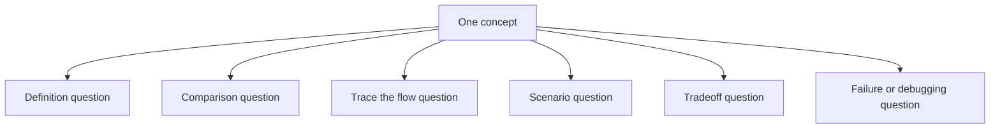

### Example: API concept across question styles

- **Definition:** What is an API?
- **Comparison:** REST vs GraphQL?
- **Trace the flow:** How does the request move from form submit to database?
- **Scenario:** How would you create a user record from a frontend form?
- **Tradeoff:** Why not connect the frontend directly to the database?
- **Failure mode:** Why am I getting a 400 or CORS error?

### The universal answer method

When a question sounds confusing, silently reduce it to one of these:

1. Are they asking what it is?
2. Are they asking how it works?
3. Are they asking why it matters?
4. Are they asking when to use it?
5. Are they asking what can go wrong?
6. Are they asking how I used it in my own work?

If you can answer those six angles for a concept, you can survive most phrasings.

## 29. Browser, Network, Request, And Rendering Deep Dive

This is the part many candidates skip. Interviewers like it because it shows whether you understand the web beyond frameworks.

### What happens when you type a URL and press Enter?

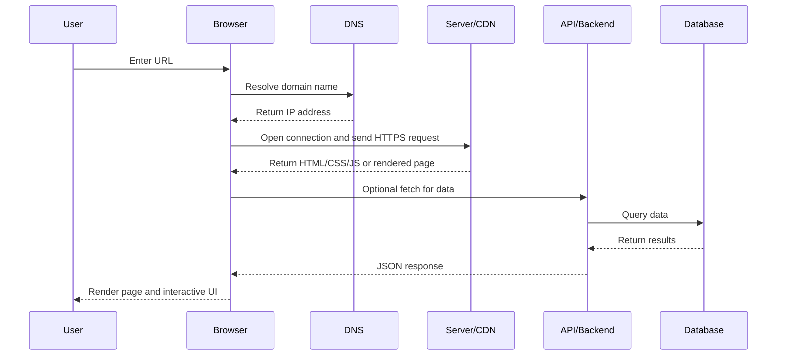

### Simple explanation

1. The browser finds the server IP using DNS.
2. The browser connects to the server.
3. If the site uses HTTPS, a secure TLS handshake happens.
4. The browser sends an HTTP request.
5. The server or CDN returns page assets or rendered HTML.
6. JavaScript runs in the browser.
7. The page may make API requests for more data.
8. The browser renders the result for the user.

### DNS in simple words

DNS is like the phonebook of the internet. Humans remember domain names like `example.com`, but computers route requests using IP addresses.

Good answer:

"DNS translates a domain name into an IP address so the browser knows which server to contact."

### What is TCP and why do you care?

TCP is a transport protocol used for reliable communication. It matters because web requests need ordered, reliable delivery.

Beginner-safe answer:

"I do not usually work directly with TCP settings in application code, but I know it is the reliable transport layer underneath HTTP connections."

### What is TLS?

TLS is the security layer used by HTTPS. It encrypts data between browser and server.

Good answer:

"HTTPS is HTTP over TLS. TLS protects data in transit so login details or tokens are not sent as plain readable text."

### HTTP request anatomy

An HTTP request has:

- a method like GET or POST
- a URL
- headers
- optionally a body

Example:

```http
POST /api/users HTTP/1.1
Content-Type: application/json
Authorization: Bearer token_here

{
  "firstName": "Rishita"
}
```

### HTTP response anatomy

An HTTP response has:

- a status code
- headers
- response body

Example:

```http
HTTP/1.1 201 Created
Content-Type: application/json

{
  "id": 42,
  "firstName": "Rishita"
}
```

### Browser rendering pipeline

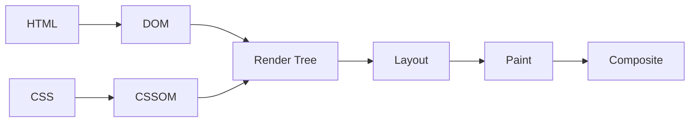

Simple explanation:

- browser parses HTML into the DOM
- browser parses CSS into the CSSOM
- browser combines them into a render tree
- browser calculates layout
- browser paints pixels to the screen

### Why JavaScript can make a page feel slow

- too much JS must be downloaded
- too much JS must be parsed
- too much JS blocks the main thread
- too many re-renders or heavy loops happen

### What is caching?

Caching means storing something so it can be served faster later.

Common cache layers:

- browser cache
- CDN cache
- server cache
- client-side data cache

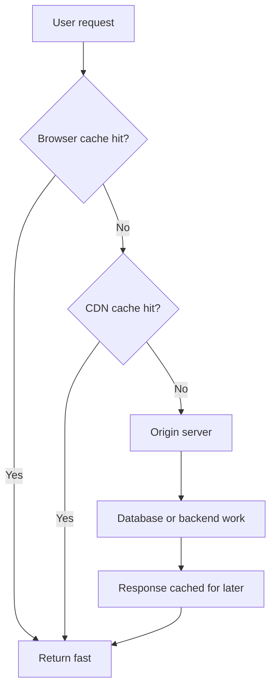

### CDN in plain English

A CDN serves static or cacheable content from locations closer to users. That reduces latency and often improves load time.

### Cookies vs localStorage vs sessionStorage again, but with interview depth

| Tool | Main use | Sent automatically with requests? | Lifetime |
| --- | --- | --- | --- |
| Cookies | sessions, preferences | often yes | configurable |
| localStorage | client-side persistent data | no | until cleared |
| sessionStorage | tab-specific temporary data | no | until tab closes |

Important security note:

- httpOnly cookies cannot be read by JavaScript, which makes them safer for many auth flows than storing tokens in localStorage

### WebSocket vs HTTP vs webhook vs polling

- **HTTP:** client asks server for data
- **Polling:** client asks server repeatedly on a timer
- **Webhook:** server notifies another server when an event happens
- **WebSocket:** persistent two-way connection for real-time communication

Good answer:

"For normal CRUD data, HTTP is enough. For real-time updates like chat or live dashboards, WebSockets may be better. For system-to-system event notifications, webhooks are common."

### High-probability browser/network questions

**What is the difference between a domain and a URL?**

"A domain is the human-readable site name like example.com. A URL is the full address including protocol, domain, path, and sometimes query parameters."

**What is the difference between a path parameter and a query parameter?**

"A path parameter is usually part of the resource identity, like `/users/5`. A query parameter usually modifies the request, like filtering, sorting, or pagination, for example `/users?page=2`."

**Why is HTTPS important?**

"Because it encrypts data in transit and protects users from sending sensitive information over plain text."

## 30. Security Deep Dive For Interviews

Security questions often sound intimidating, but most beginner-friendly interviews want the basics, not advanced cryptography.

### Defense in depth

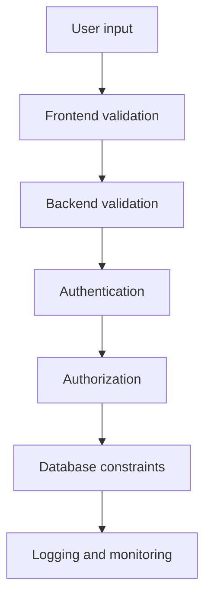

The big idea is simple: do not trust one layer alone.

### Authentication vs authorization

- **Authentication:** proves who the user is
- **Authorization:** checks what that user is allowed to do

Example:

- login form checks identity -> authentication
- checking whether the user can access admin dashboard -> authorization

### Sessions vs JWTs

| Approach | Where session truth lives | Common use | Tradeoff |
| --- | --- | --- | --- |
| Session | server-side store | classic web apps | server must track session |
| JWT | token carries claims | APIs and distributed systems | token invalidation can be harder |

Beginner-safe answer:

"Both are valid patterns. Sessions keep more state on the server. JWT-based auth is more stateless, where the token carries identity-related claims."

### How passwords should be stored

Never in plain text.

Passwords should be stored as hashes using strong password hashing algorithms like bcrypt, scrypt, or Argon2.

Good answer:

"Passwords should be hashed and salted, not encrypted and definitely not stored as plain text. The server should compare hashes, not raw passwords."

### What is a hash?

A hash turns input into a fixed-length output. Good password hashing algorithms are designed to be slow enough to resist brute-force attacks.

### What is salting?

A salt is random data added before hashing so that the same password does not always produce the same stored result.

### What is XSS?

XSS means Cross-Site Scripting. It happens when malicious JavaScript is injected into a page and then runs in another user's browser.

Common prevention ideas:

- escape untrusted output
- avoid unsafe HTML injection
- sanitize user content when needed
- use framework-safe rendering patterns
- use Content Security Policy where appropriate

### What is CSRF?

CSRF means Cross-Site Request Forgery. It tricks a logged-in browser into sending unwanted requests.

Common prevention ideas:

- CSRF tokens
- same-site cookies
- checking origin or referer where appropriate

### What is SQL injection?

SQL injection happens when untrusted input is concatenated into SQL in a dangerous way.

Prevention:

- parameterized queries
- ORMs used correctly
- validation and sanitization

### Very common trap question: Is CORS a security feature for your API?

Best answer:

"CORS is a browser-enforced rule about cross-origin requests. It helps browsers decide whether frontend JavaScript from one origin may call another origin. It is not a replacement for authentication or authorization."

### Why frontend validation is not enough

Because users can bypass the frontend, call the API directly, or alter requests.

### What is rate limiting?

Rate limiting restricts how many requests a client can make in a time window.

Why it matters:

- prevents abuse
- reduces brute-force attacks
- protects system stability

### Secrets management

Do not hardcode API keys, DB passwords, or signing secrets in source code.

Use:

- environment variables
- secret managers in production

### Good security answers you can safely use

**How do you secure an API?**

"At a practical level I think about secure transport with HTTPS, authentication to verify identity, authorization to check permissions, validation on the server, safe database access through parameterized queries or an ORM, and keeping secrets out of the codebase."

**How do you prevent unauthorized data access?**

"Do not rely only on the frontend. The backend must verify the user's identity and also check that the user is allowed to access the specific record or action."

## 31. Data Modeling, SQL, MongoDB, And Query Thinking

This is where interviewers often ask things that sound more academic, like ACID, joins, normalization, or schemas.

### Think in entities and relationships

A good full-stack developer should be able to see data in terms of business objects.

Example entities from your experience:

- users
- products
- storefronts
- client records
- tasks
- workflow items
- uploaded documents
- document chunks
- retrieval results

### Relational model mental picture

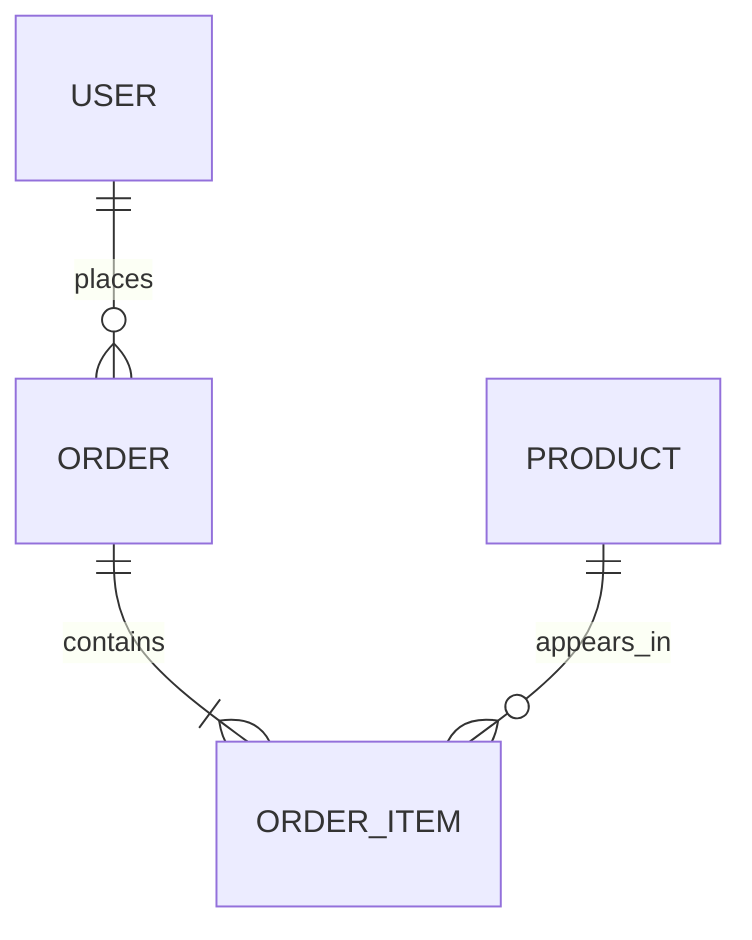

This shows:

- one user can place many orders
- one order can contain many order items
- one product can appear in many order items

### Primary key vs foreign key

- **Primary key:** unique identifier for a table row
- **Foreign key:** links one table to another table's primary key

### One-to-one, one-to-many, many-to-many

- **One-to-one:** one user has one profile
- **One-to-many:** one user has many orders
- **Many-to-many:** many students join many courses

Many-to-many usually needs a join table.

### Unique constraint

A unique constraint means the value must not repeat, such as email in a users table.

### NULL vs NOT NULL

- **NULL:** missing or unknown value
- **NOT NULL:** value is required

### Schema design in simple language

Schema design means deciding:

- what entities exist
- what fields they have
- what types those fields are
- what is required
- how records relate to each other

### Normalization vs denormalization

**Normalization** reduces duplication by splitting data into separate related tables.

**Denormalization** duplicates or precomputes some data when read speed or query simplicity matters more.

Good answer:

"Normalization keeps data cleaner and reduces duplication. Denormalization can improve read performance in some cases but introduces consistency tradeoffs."

### Transaction and ACID refresher with better intuition

A transaction groups multiple data operations so they succeed together or fail together.

Imagine checkout flow:

1. create order
2. reduce product inventory
3. save payment reference

If step 2 fails, you may want all steps rolled back.

That is where transactions matter.

### Isolation in beginner-friendly terms

Isolation means concurrent operations should not break each other.

Simple example:

- two users try to buy the last item at the same time
- the database should avoid inconsistent results

### Indexes in deeper interview language

Indexes help queries find rows faster, but:

- they consume extra space
- writes can become slightly slower because indexes must also be updated

Good answer:

"I add indexes for fields that are searched, filtered, joined, or sorted often, but not blindly on every field because indexes also have maintenance cost."

### What is an N+1 query problem?

It happens when code fetches a list and then separately fetches related data for each item one by one.

Example:

- fetch 100 users
- then fetch each user's orders in 100 extra queries

This is inefficient.

Solutions:

- join queries
- eager loading
- batching

### SQL concepts you should know at interview level

**SELECT** retrieves data.

**INSERT** adds data.

**UPDATE** changes data.

**DELETE** removes data.

**WHERE** filters rows.

**ORDER BY** sorts rows.

**GROUP BY** groups rows for aggregation.

**COUNT, SUM, AVG** are aggregate functions.

### INNER JOIN vs LEFT JOIN again, with intuition

- **INNER JOIN:** only rows with a match in both tables
- **LEFT JOIN:** all rows from the left table, plus matching rows from the right if present

### MongoDB mental model

MongoDB stores documents, usually JSON-like objects.

Good when:

- data is document-shaped
- schema flexibility helps
- nested structures are natural

### Embed vs reference in MongoDB

- **Embed** when related data is closely tied and usually read together
- **Reference** when data is reused or grows independently

### Aggregation pipeline in MongoDB

Aggregation pipeline means processing documents in stages, like filtering, grouping, reshaping, or summarizing data.

### Prisma mental model with example

Prisma schema might define models like:

```prisma
model Document {
  id      Int      @id @default(autoincrement())
  title   String
  chunks  Chunk[]
}

model Chunk {
  id         Int      @id @default(autoincrement())
  content    String
  documentId Int
  document   Document @relation(fields: [documentId], references: [id])
}
```

This means:

- one document has many chunks
- each chunk belongs to one document

### Database migration in simple language

A migration is a tracked change to the database schema, such as adding a column or new table.

### Likely database questions and strong answers

**When would you choose PostgreSQL over MongoDB?**

"When the data is structured, relational, and consistency matters strongly, PostgreSQL is often a better fit. MongoDB is useful when the data is more document-like or schema flexibility is helpful."

**What is a foreign key?**

"A foreign key is a field in one table that references the primary key of another table so the relationship stays valid."

**Why use Prisma instead of raw SQL?**

"Prisma improves type safety, developer productivity, and readability for common CRUD work, while raw SQL may still be useful for very custom or performance-sensitive queries."

## 32. React Deep Dive: Rendering, State, Effects, And Common Traps

### React mental model in one line

React lets you describe UI as a function of state.

### How rendering really works at interview level

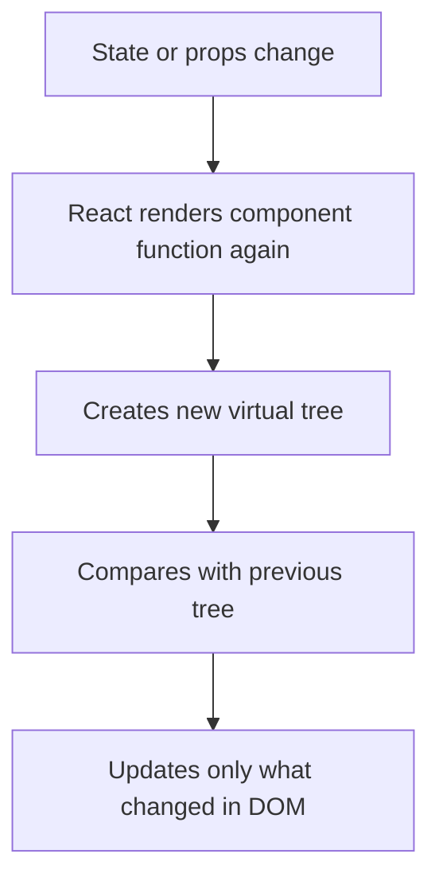

### Source of truth

One common interview idea is the source of truth.

Example:

- if the parent owns the form data, the parent is the source of truth
- if each child owns its own field state, the children are the source of truth

### Lifting state up

If two sibling components need the same data, move the state to their closest common parent.

### Derived state vs real state

Store the minimal true state.

Example:

- store `searchTerm`
- compute `filteredProducts` from `searchTerm` and `products`

Do not store unnecessary duplicate state if it can be derived safely.

### Controlled vs uncontrolled inputs again, with intuition

- **Controlled:** React state owns the value
- **Uncontrolled:** DOM owns the value, usually accessed with a ref

Controlled inputs are easier for validation, conditional UI, and form handling.

### `useEffect` in plain English

`useEffect` is for side effects that happen after rendering.

Examples:

- fetching data
- setting up a subscription
- starting a timer
- syncing with non-React code

### Common `useEffect` pitfalls

- forgetting dependencies
- infinite loops caused by updating state in the effect incorrectly
- stale values due to closure issues
- not cleaning up subscriptions or timers

### Cleanup function

If an effect sets up something, cleanup tears it down.

Example:

- add event listener on mount
- remove event listener on unmount

### What is a ref?

A ref is a mutable holder that does not trigger re-render when changed.

Common uses:

- access a DOM node
- keep a value across renders without causing UI update

### `useMemo` vs `useCallback`

- `useMemo` memoizes a computed value
- `useCallback` memoizes a function reference

Use them when they solve a real performance or dependency problem, not automatically everywhere.

### What is React reconciliation?

Reconciliation is how React compares the new virtual tree with the previous one to figure out what changed.

### Why keys matter

Keys help React match list items correctly across renders.

Bad key choice:

- array index when items are reordered or removed

Better key:

- stable record ID

### What is prop drilling?

Passing props through many components that do not use them just so a deep child can receive them.

Solutions:

- lift state differently
- use Context API
- use a state library if needed

### Context vs Redux vs Zustand vs React Query

| Tool | Best for | Not ideal for |
| --- | --- | --- |
| useState | local UI state | deeply shared state across app |
| Context | light shared app state | very frequent large updates everywhere |
| Redux/Zustand | larger shared client state | tiny local component state |
| React Query/SWR | server state and caching | pure local UI toggles |

### Server state vs client state

- **Client/UI state:** modal open, current tab, local form input
- **Server state:** users, products, tasks, fetched from API

This distinction is important in interviews.

### How to answer React performance questions safely

"First I check whether there is an actual problem. Then I look for unnecessary re-renders, overly large lists, expensive computations, repeated network calls, or too much JS work on the client. Depending on the issue I might use memoization, pagination, virtualization, code splitting, or better state placement."

### Common React follow-up questions

**Why does changing state re-render the component?**

"Because React needs to recalculate what the UI should look like for the new state."

**Why not mutate state directly?**

"Because React depends on detecting state changes reliably. Immutable updates make those changes clearer and safer."

**What is a custom hook?**

"A custom hook is a function that reuses stateful logic between components, such as data fetching or form behavior."

## 33. Next.js Deep Dive: Rendering, Routing, Hydration, And Server/Client Boundaries

Next.js questions often become hard because people memorize terms without understanding where code runs.

### First principle: ask where the code runs

- browser?
- server?
- build time?
- on every request?
- after hydration?

### Rendering strategies comparison

| Strategy | When HTML is produced | Good for | Tradeoff |
| --- | --- | --- | --- |
| CSR | mostly in browser | app-like interactions | weaker first load and SEO by default |
| SSR | on each request | user-specific or fresh data | more server work |
| SSG | at build time | stable content | data is not fresh by default |
| ISR | build time plus revalidation | mostly static content with freshness | more caching complexity |

### Next.js request-to-page mental model

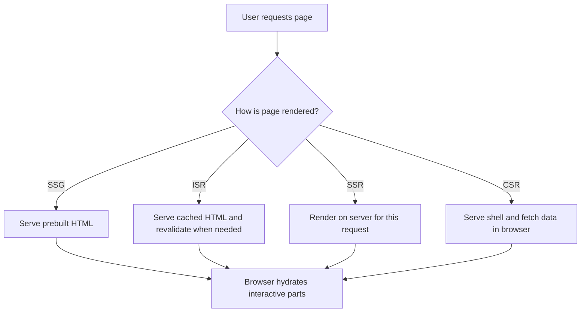

### What is hydration?

Hydration is when the browser attaches React interactivity to HTML that was already rendered.

### What is a hydration mismatch?

It happens when the HTML generated on the server does not match what React expects on the client.

Common causes:

- using browser-only values during server rendering
- time-based values changing between server and client
- random values generated differently on each side

### Server Components vs Client Components

**Server Components:**

- run on the server
- good for fetching data and reducing client bundle size
- cannot use browser-only hooks like `useState` for interactivity in the same way

**Client Components:**

- run in the browser
- required for click handlers, local state, and browser APIs

### Next.js routing mental model

Routes come from file structure. Dynamic segments represent variable values.

Example:

- `/products/[id]` means one route pattern for many product IDs

### Layouts and nested routing

Layouts let shared UI remain stable across nested pages.

Example:

- dashboard sidebar stays mounted
- only inner content area changes

### Route handlers vs separate Express server

Route handlers or API routes are useful for colocated backend logic inside the Next.js app.

Separate backend services are useful when:

- many clients use the same API
- backend needs independent scaling
- architecture is already service-oriented

### Middleware in Next.js

Middleware runs before the request finishes and is often used for:

- redirects
- auth checks
- rewriting requests

### Caching in Next.js at a simple level

You should know that data and pages may be cached differently depending on strategy.

### Loading, error, and not-found states

Interviewers like candidates who think beyond the happy path.

Always mention:

- loading state
- empty state
- error state
- not-found state

### SEO in Next.js

Why Next.js helps:

- server-rendered HTML can be easier for search engines to index
- metadata management is simpler
- performance improvements often help SEO too

### Safe answer if asked which router you used most

"My production experience was stronger with the earlier style routing, but I understand the App Router model conceptually, especially the distinction between server and client components, nested layouts, and direct server-side data fetching."

## 34. API Design, Backend Patterns, And Real-World Data Flows

### Good API design principles

- consistent naming
- predictable status codes
- clear error responses
- separation of concerns
- validation on the backend
- pagination for large result sets

### Example of a clean API response shape

Success:

```json
{
  "data": {
    "id": 42,
    "firstName": "Rishita"
  }
}
```

Error:

```json
{
  "error": {
    "code": "VALIDATION_ERROR",
    "message": "firstName is required"
  }
}
```

### Why consistent error shapes matter

Because the frontend can handle errors more predictably.

### Idempotency

An operation is idempotent if repeating it has the same effect as doing it once.

Examples:

- GET is usually idempotent
- DELETE is usually idempotent if deleting the same resource repeatedly leaves the same end state
- POST is often not idempotent by default

### Why idempotency matters

- retries
- network failures
- duplicate submissions

### Pagination, sorting, and filtering

```mermaid
flowchart LR
    A[Client asks for users] --> B[Filter by status]
    A --> C[Sort by created date]
    A --> D[Paginate results]
    B --> E[/users?status=active]
    C --> F[/users?sort=createdAt&order=desc]
    D --> G[/users?limit=20&page=2]
```

### Offset pagination vs cursor pagination

- **Offset pagination:** easy to understand, common for simple UIs
- **Cursor pagination:** better for large or frequently changing datasets

### API versioning

Sometimes APIs use versions like `/api/v1/users` so newer changes do not break old clients.

### REST vs GraphQL

| REST | GraphQL |
| --- | --- |
| multiple endpoints by resource | usually one endpoint with flexible queries |
| simple and familiar | flexible client-driven data shape |
| easy to cache with HTTP conventions | more flexible but can be more complex |

Good answer:

"REST is simpler and was the pattern I used most directly. GraphQL can reduce overfetching and give clients more control, but it also adds its own complexity."

### File uploads

File uploads often use `multipart/form-data` instead of JSON.

Flow:

1. user selects file
2. frontend sends file and metadata
3. backend validates type and size
4. backend stores file or forwards to storage
5. backend stores record metadata in DB

### Webhooks vs polling

- **Webhook:** event pushes from one server to another
- **Polling:** client repeatedly asks for new info

### Background jobs and queues

If work is slow or heavy, do not always keep the user waiting in the request.

Use queues or background jobs for things like:

- sending emails
- processing uploaded PDFs
- generating reports

### API design answers that connect to your work

**How did your frontend use the API?**

"The UI collected input through forms, filters, and navigation actions. It sent structured requests to API endpoints, received JSON responses, and updated the screen based on success, loading, error, or empty states."

**Why not connect the frontend directly to the database?**

"Because the backend protects secrets, enforces validation and authorization, centralizes business logic, and acts as the safe layer between the public client and the database."

## 35. State Management, Data Fetching, Forms, And Cache Thinking

### One of the most important distinctions: UI state vs server state

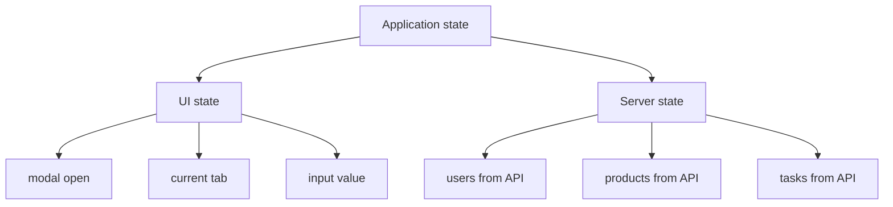

### Why this distinction matters

Local UI state is usually best handled with component state.

Server state often benefits from:

- fetch lifecycle handling
- caching
- refetch logic
- background refresh

That is why tools like React Query or SWR exist.

### Loading, error, empty, and success states

If you only talk about the success state, interviewers may think you have not built real screens.

Every data view should think about:

- loading
- error
- empty data
- successful data

### Debouncing

Debouncing delays a function so it only runs after the user stops typing for a moment.

Common use:

- search fields

Why it matters:

- fewer unnecessary API calls

### Race conditions in data fetching

Race condition example:

- user types quickly
- request A is sent
- request B is sent
- request B should win, but request A returns later and overwrites the newer results

Possible solutions:

- cancel old requests
- track latest request
- use data-fetching libraries that handle stale data well

### Optimistic UI

Optimistic UI updates the screen before the server confirms success.

Example:

- user clicks "like"
- UI updates immediately
- if server fails, UI rolls back

### Form validation strategy

Good pattern:

1. validate obvious issues on the client
2. disable duplicate submission while pending
3. validate again on the server
4. show field errors or general error messages clearly

### Accessible form basics

- every input should have a label
- errors should be associated with the relevant field
- keyboard users should be able to navigate the form
- focus should move sensibly after errors or success

### File upload questions

**How do you handle file uploads?**

"The frontend collects the file and metadata, submits it using multipart form data, and the backend validates size and type, stores the file or its processed output, and saves metadata in the database."

### Good answers for state management questions

**When would you use Context instead of Redux?**

"For lighter shared state like auth, theme, or language, Context is often enough. For larger global client state with many updates and patterns, a dedicated state library can scale better."

**What is server state?**

"Server state is data owned by the backend, such as users, tasks, or products. The frontend only fetches, displays, caches, and mutates it through APIs."

## 36. Performance, UX, Accessibility, And Responsive Design

This section matters because many frontend interviews go beyond React syntax.

### Core Web Vitals at a beginner level

- **LCP:** how quickly main content becomes visible
- **INP:** responsiveness to interactions
- **CLS:** how much layout unexpectedly shifts

You do not need to sound like a browser engineer. Just know what they measure.

### Performance checklist mental model

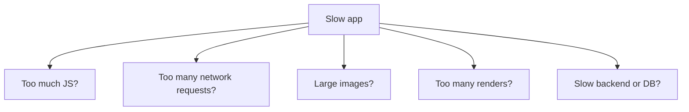

### Code splitting

Code splitting means loading only the JavaScript needed for the current page or feature instead of one giant bundle.

### Lazy loading

Lazy loading means delaying loading until the content is needed.

Examples:

- route-based code splitting
- loading images when near viewport
- loading heavy components only on demand

### Tree shaking

Tree shaking removes unused code during bundling.

### Image optimization

Common practices:

- correct dimensions
- compressed formats
- responsive sizes
- lazy loading where appropriate

### Large list optimization

If you render very large lists, consider:

- pagination
- virtualization
- infinite scrolling carefully

### Memoization and when not to overuse it

Memoization is useful when it prevents real unnecessary work. Overusing it can add complexity without benefit.

### Responsive design

Responsive design means the layout adapts to different screen sizes.

### Mobile-first design

Mobile-first means starting with smaller screens and enhancing upward.

### Flexbox vs Grid

| Flexbox | Grid |
| --- | --- |
| one-dimensional layout | two-dimensional layout |
| great for rows or columns | great for page or card grids |

### Styling approaches you should know: CSS, Tailwind, Sass/SCSS, and CSS Modules

Even if Tailwind or Sass are not the main tools listed on your resume, interviewers may still ask about them because they are common in React and Next.js projects.

| Approach | What it is | Good for | Tradeoff |
| --- | --- | --- | --- |
| Plain CSS | regular stylesheet rules | direct control and fundamentals | can become hard to manage at scale |
| Sass/SCSS | CSS preprocessor with extra features | larger stylesheets, shared variables, mixins, nesting | still needs naming and structure discipline |
| CSS Modules | locally scoped CSS files per component | avoiding global style collisions in component-based apps | can create many small files |
| Tailwind CSS | utility-first CSS framework | fast UI building, consistent spacing and responsive styling | markup can get class-heavy |

### What is Tailwind CSS?

Tailwind CSS is a utility-first CSS framework. Instead of writing many custom class names and then styling them in separate files, you compose small utility classes directly in the markup.

Example idea:

- `flex`
- `items-center`
- `p-4`
- `text-sm`
- `md:grid-cols-2`

Good answer:

"Tailwind is a utility-first CSS framework where you build the UI by composing small predefined classes for spacing, layout, typography, colors, and responsive behavior directly in the component markup."

### Why teams use Tailwind

- fast UI development
- consistent spacing and design tokens
- responsive utilities built in
- fewer naming problems than large global CSS files
- works well in component-based apps like React and Next.js

### Tailwind tradeoffs

- JSX or HTML can become visually dense with many classes
- people who prefer semantic class names may dislike the utility-heavy style
- teams still need design discipline or the UI can become inconsistent anyway

### What is Sass or SCSS?

Sass is a CSS preprocessor. SCSS is the more CSS-like syntax of Sass.

It adds features like:

- variables
- nesting
- mixins
- partials
- reusable functions

Good answer:

"Sass or SCSS is CSS with extra features for organization and reuse, such as variables, nesting, and mixins, which can make larger styling codebases easier to manage."

### Sass vs SCSS

- **SCSS:** uses braces and semicolons and looks very similar to regular CSS
- **Sass:** uses indentation-based syntax without braces and semicolons

In most frontend interviews, when people casually say "Sass," they are often talking about SCSS-style usage.

### When SCSS is useful

- large design systems with repeated style patterns
- shared variables like colors and spacing
- mixins for repeated responsive or layout rules
- teams that want stylesheet organization outside the markup

### Tailwind vs SCSS in simple language

- **Tailwind:** compose lots of small utility classes directly in the component
- **SCSS:** write styles in stylesheet files using variables, nesting, and mixins

Good comparison answer:

"Tailwind moves styling composition closer to the markup using utility classes, while SCSS keeps more of the styling logic in stylesheet files with features like variables, nesting, and mixins. Tailwind is often faster for consistent component work, while SCSS can feel cleaner for teams that prefer more traditional stylesheet organization."

### Tailwind vs CSS Modules

- **Tailwind:** utility-first styling in markup
- **CSS Modules:** locally scoped CSS classes written in separate files

Good answer:

"CSS Modules solve style scoping by giving components local CSS classes, while Tailwind solves a different problem by providing utility classes so you write less custom CSS in the first place."

### How responsive styling works in Tailwind

Tailwind usually uses breakpoint prefixes like:

- `sm:`
- `md:`
- `lg:`
- `xl:`

Example idea:

- `grid-cols-1 md:grid-cols-2 lg:grid-cols-4`

This means the layout changes as the screen gets larger.

### Likely styling questions and strong answers

**What is Tailwind CSS?**

"Tailwind is a utility-first CSS framework used to build UI by composing small predefined classes directly in the markup."

**Why do companies use Tailwind?**

"Because it speeds up UI implementation, makes spacing and layout more consistent, and works well with component-based development."

**What is Sass or SCSS?**

"It is a CSS preprocessor that adds features like variables, nesting, mixins, and reusable stylesheet organization."

**What is the difference between Sass and SCSS?**

"SCSS uses normal CSS-like syntax with braces and semicolons, while Sass uses indentation syntax."

**When would you choose Tailwind over SCSS?**

"I would choose Tailwind when the team values fast component styling, utility-first consistency, and tight integration with React or Next.js markup. I would choose SCSS when the team prefers more traditional stylesheet structure and reusable style abstractions outside the component markup."

**What if the project uses Tailwind and you have stronger experience in regular CSS?**

"That is a reasonable adjustment because the core frontend ideas are still the same: layout, spacing, responsiveness, accessibility, and consistency. Tailwind mainly changes how those styles are expressed and organized."

### Safe answer if your hands-on Tailwind or SCSS depth is limited

"I understand Tailwind and SCSS at the practical frontend level and how they fit into React and Next.js projects. My strongest proven styling work on the resume is reusable UI, responsive implementation, and Figma-to-code, and I can apply those same fundamentals whether the team uses standard CSS, CSS Modules, Tailwind, or SCSS."

### Accessibility basics you should know

- use semantic HTML first
- buttons for actions, links for navigation
- labels for form fields
- alt text for meaningful images
- keyboard accessibility
- visible focus states
- appropriate ARIA only when native HTML is not enough

### What makes a site accessible?

Good answer:

"Semantic HTML, proper labels, keyboard support, clear focus behavior, readable contrast, and screen-reader-friendly structure are the basics."

### Common trap: button vs link

- use a **button** for an action
- use a **link** for navigation

### Responsive interview answer you can use

"I think about responsive design from layout, spacing, typography, and interaction. I usually start from a simple mobile-friendly structure, then adapt it for larger screens using flexible layouts, breakpoints, and reusable components."

## 37. Testing, Debugging, Logging, And Monitoring

Many interviewers ask this to see whether you know how real software quality works.

### Testing pyramid

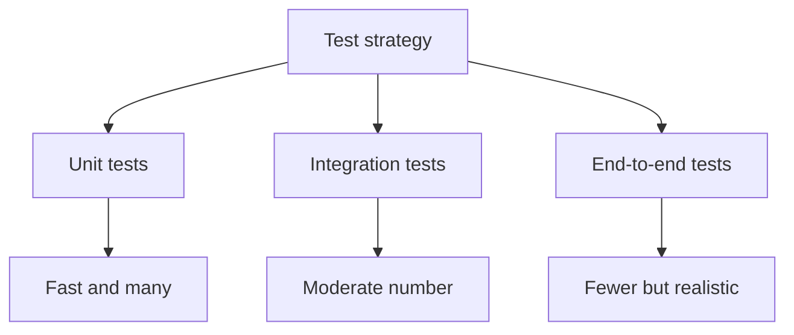

### Unit vs integration vs end-to-end

- **Unit test:** tests one small piece in isolation
- **Integration test:** tests parts working together
- **End-to-end test:** tests a real user flow through the system

Example:

- unit: test a validation function
- integration: test API route plus database logic together
- e2e: test login form to dashboard navigation in browser

### What is mocking?

Mocking means replacing a real dependency with a fake version in tests.

Example:

- mock API response
- mock database call

### Good testing answer even if your testing depth is moderate

"I understand the difference between unit, integration, and end-to-end testing. In practical application work I focus on validating critical logic, API behavior, and user flows rather than pretending every line is heavily tested."

### Debugging mental model

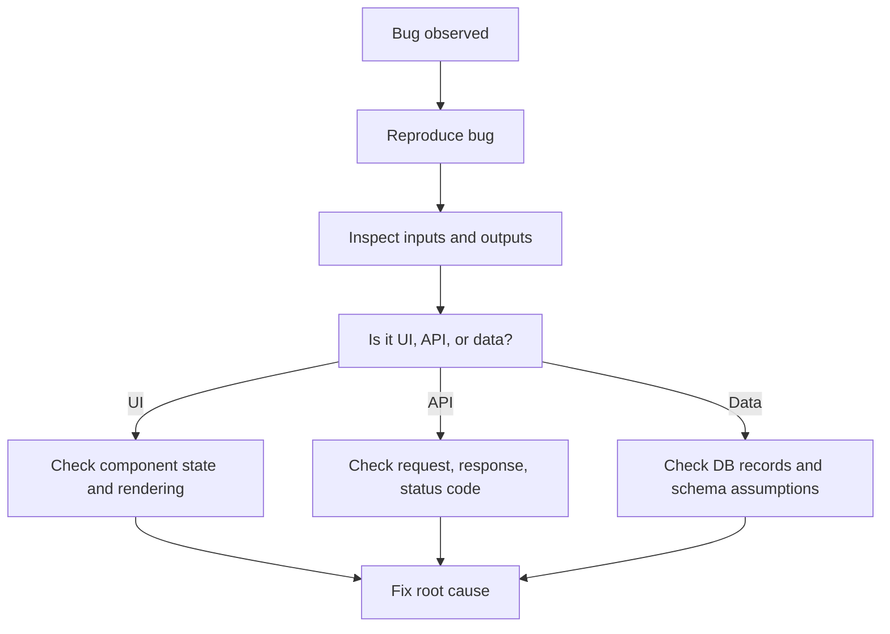

### Stack trace in plain words

A stack trace shows the call path that led to an error.

### Good debugging answer from your resume

"I debug by tracing the flow layer by layer. For frontend issues I inspect component state, props, and the network call. For API issues I inspect request payload, status codes, and backend logic. For data issues I compare what the database contains versus what the UI expects."

### What should you log?

Useful logs often include:

- request ID or correlation ID if available
- operation name
- error context
- high-level payload facts when safe

Do not log:

- passwords
- raw secrets
- unnecessary sensitive personal data

### Monitoring vs logging vs tracing

- **Logging:** records events or errors
- **Monitoring:** tracks system health and alerts
- **Tracing:** follows a request across multiple services or steps

### Production debugging answer if you have not owned major monitoring tools

"I have more experience debugging through browser tools, network requests, API responses, and application logs than owning full production observability platforms, but I understand the value of structured logs, error monitoring, and metrics."

## 38. Git, Teamwork, Delivery, And Dev Workflow Basics

### Why Git questions matter

Because companies want to know whether you can work safely with a team, not only write code alone.

### Basic Git workflow

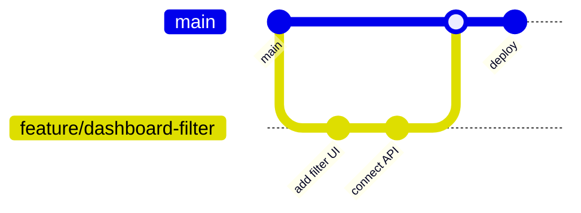

### Terms you should know

- repository
- branch
- commit
- merge
- rebase
- pull request
- merge conflict
- revert

### What is a branch?

A branch is a separate line of development so you can work on a feature without changing main immediately.

### What is a pull request?

A pull request is a proposal to merge code changes, usually with review and discussion.

### Merge conflict in simple language

A merge conflict happens when Git cannot automatically combine changes because two versions overlap.

### Rebase vs merge

Beginner-safe answer:

"Merge combines histories as they are. Rebase rewrites the feature branch onto a newer base so history can look cleaner, but teams vary in which workflow they prefer."

### Good commit messages

Good commit messages say what changed and why.

Example:

- `Add dashboard status filter and API query param handling`

### Code review answers

**What do you look for in a code review?**

"Correctness, readability, edge cases, naming clarity, maintainability, and whether the change matches the intended behavior."

### CI/CD in simple terms

CI/CD means automated steps that check and deploy code.

- **CI:** continuous integration, such as running checks when code is merged
- **CD:** continuous delivery or deployment, meaning getting changes safely toward production

### Environment variables again, from a delivery perspective

Environment variables help different environments use different settings without changing code.

Examples:

- local DB URL
- staging API key
- production secret

### Docker at interview-safe level

If asked and you have only light experience:

"I understand Docker as a way to package an application with its dependencies so it runs consistently across environments. My hands-on experience is lighter than my application-layer work, so I would not overclaim deep container orchestration experience."

## 39. System Design Basics For Full-Stack Interviews

You do not need to sound like a distributed systems architect for many junior or early mid-level interviews. They usually want structured thinking.

### What interviewers want in a basic system design answer

1. Clarify requirements.
2. Identify main components.
3. Define data flow.
4. Mention storage.
5. Mention scaling or bottlenecks simply.
6. Mention tradeoffs.

### Generic full-stack system picture

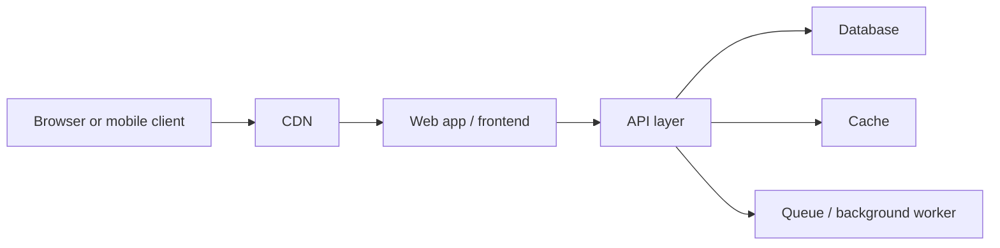

### What each box means

- **CDN:** speeds up static delivery
- **Web app:** renders UI
- **API layer:** validation, auth, business logic
- **Database:** persistent storage
- **Cache:** faster repeated reads
- **Queue/worker:** handles slow background tasks

### Common design question: how would you design a notification system?

Simple answer structure:

1. app creates notification event
2. backend stores notification record
3. worker or service delivers it
4. user reads from inbox or receives push/email

Potential concerns:

- retry failed deliveries
- separate real-time display from long-term storage

### Common design question: how would you design a URL shortener?

Simple answer structure:

1. generate unique short code
2. store mapping from short code to full URL
3. redirect when code is visited
4. optionally track analytics

### Beginner-safe scaling terms

- **Load balancer:** distributes traffic across multiple servers
- **Horizontal scaling:** add more machines
- **Vertical scaling:** make one machine bigger
- **Replication:** copy database data for read scalability or resilience
- **Sharding:** split data across databases when scale is very large

### When to mention caching in design

Mention caching when:

- same data is requested often
- data changes less often than it is read
- performance matters for repeated access

### What is eventual consistency in simple words?

It means some distributed systems may take a short time before all copies reflect the newest change.

### Safe answer if system design gets too deep

"At the level I have worked most directly, I focus on clean feature flow, reliable APIs, good data modeling, and understanding where cache, queues, and scaling fit conceptually. I would not pretend I have designed very large distributed systems alone."

### E-commerce architecture answer tied to Blackeven

"At a high level I would separate the storefront frontend from the backend product and configuration APIs, keep reusable shared UI components for multi-tenant branding, use a database for product and tenant configuration data, and place static or cacheable assets behind a CDN for fast delivery."

## 40. Question Variation Maps And Follow-Up Trees

This section is the closest thing to covering "every possible question" because it shows how interviewers can ask the same concept in many different ways.

### API concept variation tree

**Base concept:** frontend-backend communication

Possible phrasings:

- What is an API?
- How do you use APIs in your project?
- How does data move from React to Express?
- What happens after form submission?
- How do you send data to the server?
- Why do we need a backend at all?
- How do you structure request and response data?
- What does your API return after success or failure?

Likely follow-ups:

- What HTTP method would you use?
- What status code would you return?
- Where do you validate input?
- How do you handle errors?
- How do you protect the endpoint?

### Database concept variation tree

**Base concept:** persistent data storage and modeling

Possible phrasings:

- What is ACID?
- Why PostgreSQL instead of MongoDB?
- What is a schema?
- What is a join?
- What is an index?
- How did you design the database for Seminar Sidekick?
- How do relationships work in Prisma?
- Why not store everything in one table or document?

Likely follow-ups:

- What fields would you index?
- How would you represent one-to-many?
- What is normalization?
- What is a transaction?
- What is the cost of too many indexes?

### React concept variation tree

**Base concept:** state-driven UI rendering

Possible phrasings:

- What is React?
- What is state?
- What is the difference between props and state?
- Why does React re-render?
- What is the Virtual DOM?
- What is useEffect and when does it run?
- How do you avoid unnecessary re-renders?
- What is prop drilling?

Likely follow-ups:

- When would you use Context?
- Why not mutate state directly?
- What is a controlled input?
- Why are keys important in lists?

### Next.js concept variation tree

**Base concept:** rendering strategy and framework structure

Possible phrasings:

- What is Next.js?
- How is Next.js different from React?
- What is SSR?
- What is SSG?
- What is ISR?
- What is the App Router?
- What are API routes or route handlers?
- What is hydration?

Likely follow-ups:

- When would you use server rendering?
- What can go wrong with hydration?
- Why use Next.js for SEO?
- What logic should stay on the server?

### Auth and security variation tree

**Base concept:** protecting users and data

Possible phrasings:

- What is authentication?
- What is authorization?
- What is JWT?
- How do you secure a route?
- Why not trust the frontend?
- What is CORS?
- What is XSS?
- What is CSRF?

Likely follow-ups:

- How should passwords be stored?
- What data should never be logged?
- How do you prevent unauthorized access to another user's record?

### Debugging variation tree

**Base concept:** tracing the root cause of failure

Possible phrasings:

- How do you debug a broken API call?
- What would you do if the UI shows wrong data?
- How do you debug a 500 error?
- How do you debug something that works locally but not in production?
- What do you check first when a form submission fails?

Likely follow-ups:

- browser console or network tab?
- request payload or response body?
- backend logs or DB record shape?
- user permissions or validation failure?

### Resume bullet variation tree: Blackeven

Possible phrasings:

- What does multi-tenant mean?
- How were storefronts customized per client?
- What did shared components mean in practice?
- How did data get into the storefront?
- What did monorepo workflow look like for you?
- What did Cloudflare help with?

### Resume bullet variation tree: Unibox and Catiena

Possible phrasings:

- What records were in the dashboards?
- What CRUD operations did you implement?
- How did your forms connect to the backend?
- What validation happened in the API?
- What did Figma-to-code involve?
- What kinds of bugs did you debug?

### Resume bullet variation tree: Seminar Sidekick

Possible phrasings:

- What is RAG?
- Why chunk the PDF?
- What are embeddings?
- Why PostgreSQL and Prisma?
- How did retrieval improve answer quality?
- What does source-grounded mean?

### How to handle a question you still do not recognize

Use this three-step recovery:

1. identify the base concept
2. ask a clarifying question if needed
3. answer from definition, importance, project example

Example recovery phrase:

"I think you are asking about the request flow between the frontend, backend, and database. At a simple level..."

## 41. Concept Drill Pages You Can Practice Out Loud

Use these as oral drills. If you can explain each one in 30 to 90 seconds, you will handle many interview phrasings.

### Drill 1: Explain how a user's first name gets from an input field to the database

"The input field is controlled by React state. When the user types, React updates the state value. On submit, the frontend sends that value in a request body to an API endpoint. The backend route receives the request, validates the input, applies any business rules, and then uses the database layer, such as Prisma or a query, to write the value to the database. The backend returns a success or error response, and the frontend updates the UI based on that result."

### Drill 2: Explain what ACID means

"ACID describes the properties of reliable database transactions. Atomicity means all or nothing. Consistency means data stays valid according to the rules. Isolation means concurrent operations do not interfere in bad ways. Durability means committed data remains saved even if there is a crash."

### Drill 3: Explain what an API is

"An API is the contract that lets software systems communicate. In web applications, the frontend sends requests to backend API endpoints to fetch or update data, and the backend returns structured responses, usually JSON."

### Drill 4: Explain React state vs props

"Props are inputs passed into a component from its parent, while state is data the component manages itself over time. State changes trigger re-rendering."

### Drill 5: Explain Next.js vs React

"React is the library for building UI components. Next.js is the framework on top of React that adds routing, rendering options, API support, and production structure."

### Drill 6: Explain authentication vs authorization

"Authentication checks who the user is. Authorization checks what the user is allowed to do after identity is known."

### Drill 7: Explain MongoDB vs PostgreSQL

"PostgreSQL is a relational database that is strong for structured data and relationships. MongoDB is a document database that is useful when the data is more flexible or document-shaped."

### Drill 8: Explain what you did at Blackeven

"I worked on a multi-tenant e-commerce website builder using Next.js and React. My work focused on reusable storefront components, connecting product and catalog data to the UI, and contributing within a shared monorepo-style environment for multiple client storefronts."

### Drill 9: Explain Seminar Sidekick end to end

"Users upload academic PDFs and ask questions about them. The system parses and chunks the document, stores metadata and retrieval-related information, retrieves relevant chunks based on the user's question, and uses those chunks to ground the language model's answer. PostgreSQL and Prisma support the structured data layer, and Next.js handles the application interface and server-side logic."

### Drill 10: Explain how you debug an issue

"I first reproduce the problem, then narrow down whether it is in the UI, API, or data layer. I inspect state and network requests on the frontend, check request payloads and status codes for the API, and compare stored data with expected shape in the database."

## 42. How To Keep Growing This Guide

This file can keep growing over time. The best way to improve it is not to add random facts. Add material using this pattern:

1. new concept
2. simple explanation
3. why it matters
4. project example
5. common phrasings
6. likely follow-ups
7. one short answer and one deeper answer

If you do that consistently, the guide becomes more useful than a random list of 1,000 disconnected questions.

## 43. Role-Targeted Version For React, Next.js, Node.js, And C# Full-Stack Jobs

You said the role is basically around React, Next.js, Node.js, C#, and general full-stack work. That is actually helpful because it gives you a clearer target.

This kind of role is usually testing five things:

1. Can you build modern frontend screens in React and Next.js?
2. Can you connect those screens to APIs and reason about full-stack data flow?
3. Can you work on backend logic, whether it is Node.js or C# based?
4. Can you understand existing codebases, not only build greenfield demos?
5. Can you speak honestly about your stronger areas and still show that you can grow into the rest?

### What this kind of company is probably hoping to hear

- you are strong enough in React and Next.js to be productive quickly
- you understand API and database flow end to end
- you are not scared of backend work
- you can read and contribute to C# code even if it is not your deepest language today
- you can debug issues across UI, API, and data layers
- you can communicate clearly and not bluff

### The safest and strongest way to position yourself

Use this positioning:

"My strongest hands-on experience is in React and Next.js on the frontend and Node.js style API workflows on the backend, but I am comfortable working across the full stack, and I have also used C# for supporting logic and validation work. I would not claim C# is my deepest language today, but I am fully comfortable reading structured backend code, understanding the request flow, and growing further in a mixed JavaScript and .NET environment."

That answer does three useful things:

- it protects your credibility
- it still keeps you qualified for the job
- it frames you as adaptable instead of weak

### Role-targeted 30-second pitch

"I am a full-stack developer with my strongest practical experience in React and Next.js, and I have also worked with Node.js, Express, MongoDB, PostgreSQL, and Prisma across real dashboard, portal, and storefront projects. I am strongest when I can own the full flow from UI to API to database. I also have some supporting C# exposure from application-level validation and utility logic, so for a mixed React, Next.js, Node.js, and C# role, I would contribute most quickly on the frontend and full-stack application layer while continuing to deepen on the .NET side."

### Role-targeted 90-second pitch

"My strongest day-to-day experience is on the frontend with React and Next.js, where I have built reusable components, dashboards, portals, and storefront experiences. On the backend side, I have worked with Node.js and Express style REST API workflows, validation logic, authentication-aware flows, and database-backed CRUD operations using MongoDB and PostgreSQL. In projects like Seminar Sidekick, I also handled a full-stack Next.js application with server-side logic, structured data, and retrieval workflows. I have used C# in a more supporting way rather than as my deepest stack, so I would describe myself as strongest in JavaScript and TypeScript full-stack work, but capable of contributing in a mixed C# environment because the core concepts around request handling, validation, business logic, and data access transfer well."

### If they ask: Why are you applying to a role with C# if your background is stronger in React and Node?

Best answer:

"Because the frontend and full-stack application problems are the areas where I already have strong practical value, and the backend concepts I use in Node.js transfer well to C# service work. I do not treat C# as a completely different universe. The syntax and frameworks differ, but the underlying ideas like routing, validation, authentication, database access, DTOs, and debugging request flow are still familiar."

### If they ask: How comfortable are you with switching between Node.js and C#?

Best answer:

"Conceptually, I am comfortable because the backend responsibilities are similar even when the language changes. The main differences are syntax, ecosystem, and framework conventions. I would be faster immediately in JavaScript and TypeScript code, but I can still be productive in a C# codebase by understanding the request flow, data models, controller or service boundaries, and how the API contracts connect to the frontend."

### If they ask: What value would you bring first in this role?

Best answer:

"I would likely contribute fastest in React and Next.js feature work, API integration, frontend architecture at the component and screen level, and end-to-end debugging across UI and backend responses. From there I would ramp further into the C# side of the backend by following the same request-to-database patterns inside the .NET codebase."

### Role-targeted mental model

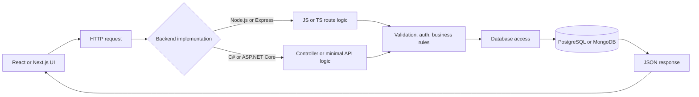

The interview lesson is this: the frontend does not care much whether the backend is Node.js or C# as long as the contract is correct. So if they push you on mixed-stack work, emphasize the shared concepts.

## 44. C# And .NET Survival Guide For A JavaScript-Focused Full-Stack Interview

This section is specifically for the gap between your strongest experience and the target role.

### What is C#?

C# is a statically typed, object-oriented programming language commonly used with the .NET ecosystem.

Simple answer:

"C# is a strongly typed programming language often used for backend development, APIs, business logic, and enterprise applications in the .NET ecosystem."

### What is .NET?

.NET is the broader platform and runtime ecosystem.

Simple answer:

"C# is the language. .NET is the broader platform it runs on."

### What is ASP.NET Core?

ASP.NET Core is a framework in the .NET ecosystem for building web applications and APIs.

Simple answer:

"ASP.NET Core plays a role similar to what Express or Next.js route handlers do in the JavaScript world, but inside the .NET ecosystem. It helps structure web APIs, middleware, routing, and application services."

### C# vs JavaScript or TypeScript in one interview answer

"C# is statically typed and compiled in the .NET ecosystem, while JavaScript is dynamically typed and typically interpreted by the runtime. TypeScript brings static typing concepts closer to the JavaScript world, which makes the transition easier conceptually."

### Why C# can feel more strict than JavaScript

- types are explicit more often
- classes and interfaces are common
- compile-time checks are stronger
- framework structure is often more formal

This is not a bad thing. It often helps maintainability in larger backend systems.

### How to explain your current C# level honestly

Use this exact style:

"My C# experience is lighter than my React, Next.js, and Node.js experience, so I would not overstate it. But I understand the role C# plays in backend application code, and I am comfortable learning and contributing within the same full-stack flow of routes, validation, business logic, and database interaction."

### ASP.NET Core request flow in plain English

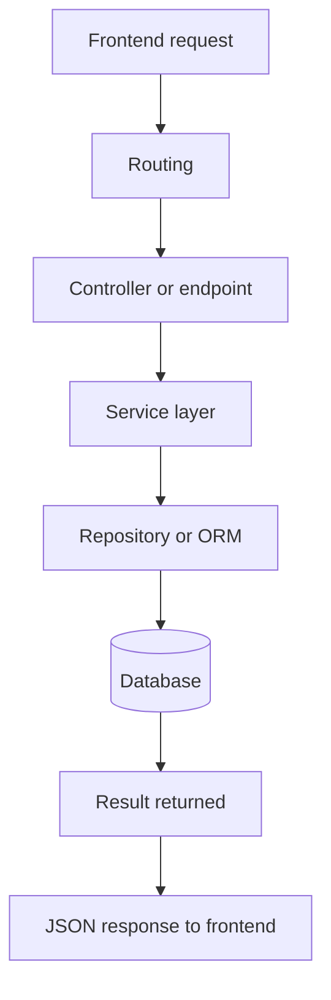

This is not identical to every codebase, but it is a very common mental model.

### Common .NET words you should recognize

#### Controller

A controller handles incoming HTTP requests and returns responses.

JavaScript comparison:

- similar idea to an Express route handler or grouped route file

#### Service

A service usually contains business logic.

Why it matters:

- keeps controllers thinner
- separates request handling from actual business rules

#### Repository

A repository is often a layer used for database access abstraction.

Important note:

- not every team uses a separate repository pattern, but many interviews still mention it

#### DTO

DTO stands for Data Transfer Object.

Simple meaning:

- an object shape used to move data between layers or between backend and client

Why it matters:

- you may not want to expose raw internal model objects directly

#### Entity

An entity usually represents the data model stored in the database.

#### Middleware

Same broad idea as in Express:

- code that runs in the request pipeline before the final response is sent

Examples:

- auth checks
- logging
- error handling

#### Dependency Injection

Dependency Injection means giving a class the objects it needs rather than making it create them directly.

Simple answer:

"Dependency Injection helps keep code modular, testable, and easier to manage because components receive their dependencies from the framework or container rather than constructing everything themselves."

#### LINQ

LINQ is a query syntax and API style in C# used to work with collections and data more expressively.

Simple answer:

"LINQ lets you filter, map, sort, and shape data in a more readable way inside C# code."

#### Entity Framework

Entity Framework Core is an ORM in the .NET ecosystem.

JavaScript comparison:

- roughly similar in purpose to Prisma or other ORMs

Good answer:

"Entity Framework Core plays a similar role to Prisma in that it helps application code work with relational data models and database operations without writing raw SQL for every query."

#### `async` and `await`

These work conceptually similarly to JavaScript async and await.

Good answer:

"One reason I am comfortable moving between Node.js and C# backend code is that async request handling, database access, and API flow still follow a familiar model even when the syntax changes."

### ASP.NET Core vs Express mental comparison

| Express / Node.js | ASP.NET Core / C# |
| --- | --- |
| route handler | controller action or endpoint |
| middleware | middleware |
| service function | service class |
| ORM like Prisma | Entity Framework Core |
| request body parsing | model binding / request parsing |
| validation middleware | validation attributes or service logic |

### Common C# interview questions and strong safe answers

**What is the difference between C# and JavaScript?**

"C# is strongly typed and typically used in the .NET ecosystem, while JavaScript is dynamically typed and runs across browser and server environments. TypeScript narrows that gap on the JavaScript side by bringing stronger typing concepts."

**What is ASP.NET Core used for?**

"It is used for building web applications and APIs in the .NET ecosystem, including routing, middleware pipelines, controllers, authentication, and backend application logic."

**What is Entity Framework?**

"It is an ORM for .NET that helps map C# models to database tables and perform database operations through application code."

**What is LINQ?**

"LINQ is a C# query style for working with collections and data in a readable, composable way, such as filtering or projecting results."

**What is Dependency Injection?**

"It is a pattern where classes receive the services they depend on instead of creating them directly, which improves modularity and testability."

**How would you compare Express middleware and ASP.NET middleware?**

"Conceptually they both sit in the request pipeline and can perform work like authentication, logging, or request processing before the final handler responds."

### If they ask something deeper on C# that you do not know

Use one of these:

- "My stronger hands-on depth is still on the JavaScript full-stack side, so I would not want to bluff that C# detail. At a conceptual level, I understand it as..."
- "I have not configured that part deeply myself in C#, but I do understand where it fits into backend API structure."
- "I can explain the equivalent concept from Node.js or Prisma, and I understand the C# version serves a similar role."

### Good concept translation lines

These are extremely useful in mixed-stack interviews.

- "In Node.js I would think of that as middleware. In ASP.NET Core it fits into the request pipeline in a similar way."
- "In Prisma I think in terms of models and relations; in Entity Framework the same broad idea exists through entities and ORM mapping."
- "In Express I would picture route plus service logic; in C# I would expect controller plus service separation."

### What not to do in the C# part of the interview

- do not pretend you are a senior .NET engineer
- do not panic and act like C# is unrelated to full-stack concepts
- do not say "I only know frontend"

Instead say:

- "My strongest depth is in React and Next.js, but I understand the backend flow conceptually across Node.js and C# style systems."

## 45. Mixed-Stack Role Questions You Are Very Likely To Get

This section is tailored specifically for roles that mix React, Next.js, Node.js, and C#.

### Frontend-focused but full-stack-aware questions

**Why React and Next.js?**

"React gives reusable, state-driven UI components. Next.js adds routing, rendering options, API support, and production-friendly structure, which makes it a strong choice for full-stack web apps."

**When would you choose Next.js over plain React?**

"When you want framework-level routing, server-side rendering options, API routes, better SEO support, and a more structured full-stack application setup."

**How do you decide what should stay on the client versus the server?**

"UI interaction, local state, and browser-only logic stay on the client. Sensitive logic, secrets, database access, and secure validation stay on the server."

**What makes a React component reusable?**

"A reusable component has a clear purpose, configurable props, minimal hardcoded assumptions, and a design that can be used across multiple screens or tenants."

### Full-stack feature flow questions

**If we ask you to build a new feature, how do you think through it?**

"I break it into user flow, UI states, API contract, validation rules, data model impact, and edge cases. Then I implement the smallest end-to-end working slice before refining."

**How do you design the API contract between frontend and backend?**

"I think about the exact input the UI needs to send, the output it needs back, validation errors, status codes, and how to keep the response shape predictable for the frontend."

**How would a Next.js frontend talk to a C# backend?**

"The same way it talks to any backend: through HTTP requests to defined API endpoints. The frontend does not need to care about the server language as long as the contract, auth, and response format are clear."

### Role-specific C# bridge questions

**You are stronger in Node.js. Why should we trust you in a C# codebase?**

"Because backend work is not only about syntax. It is about understanding request flow, validation, auth, business logic, database access, and debugging. Those concepts transfer well. I would be faster immediately in JavaScript and TypeScript, but I can still navigate and contribute to structured C# backend work."

**How would you ramp up in a .NET codebase?**

"I would first understand the request path, project structure, models, controllers or endpoints, services, data access layer, and auth flow. Then I would take smaller feature or bugfix tasks and build familiarity with the framework conventions while contributing real work."

**What would be different when debugging a Node API versus a C# API?**

"The tooling and syntax differ, but I would still follow the same logic: inspect the route entry point, validate the request shape, trace service logic, inspect database access, and verify the response object."

### API and backend questions likely in this role

**What is a DTO and why use it?**

"A DTO is a data shape used to move information between layers or across the API boundary. It helps keep contracts clearer and prevents exposing internal model structure directly."

**What is model binding?**

Beginner-safe answer:

"In frameworks like ASP.NET Core, model binding is the process of mapping incoming request data into structured objects that the endpoint can work with."

**Why use services instead of putting everything in controllers?**

"Because controllers should focus on request and response handling, while services keep the business logic organized and reusable."

**Why use an ORM instead of raw queries everywhere?**

"Because ORMs improve developer productivity, readability, and consistency for common CRUD and relationship handling, while raw queries are still useful in certain custom or performance-sensitive cases."

### Serialization and integration questions

These are very realistic in mixed JavaScript and C# environments.

**What if the frontend expects camelCase but the backend returns PascalCase?**

"Then the API contract is inconsistent and should be normalized either through backend serialization settings or a stable transformation layer, because frontend and backend should agree on a predictable shape."

**How do you handle dates between frontend and backend?**

"Carefully and explicitly. Dates should usually be exchanged in a standard serialized format, and the frontend should be deliberate about time zone display rather than assuming everything is local."

**What if a field exists in the database but is missing in the UI?**

"I would trace the flow from DB model to ORM mapping to service layer to DTO or response shape to frontend fetch handling to component props."

### Authentication questions likely in enterprise-style full-stack roles

**How would a React or Next.js app know whether a user is logged in?**

"Usually through a session or token-backed auth flow, where the frontend makes authenticated requests and receives either the current user data or an unauthorized response."

**Where should auth checks happen?**

"Auth checks should happen on the backend, not only in the frontend. The frontend can hide UI, but the backend must enforce access control."

### Production-readiness questions

**How do you make a feature production-ready?**

"I think about validation, loading and error states, edge cases, permissions, response shape consistency, logs, testing of the critical path, and whether the UI still behaves well under empty or unexpected data."

**What do you do if you join and the codebase is large?**

"I identify the user flow first, then trace one feature end to end through the frontend, API layer, and data layer. That gives me a concrete mental map instead of trying to understand the whole codebase at once."

## 46. Resume Alignment For This Specific Role

This section helps you translate your actual resume into the language this job wants to hear.

### Requirement-to-resume alignment map

| What the role wants | What from your background supports it | How to say it |
| --- | --- | --- |
| React frontend work | Blackeven, Unibox, Catiena, QueueWise | "I have built reusable React components, dashboards, portals, and storefront UI." |
| Next.js work | Blackeven and Seminar Sidekick | "I have worked with Next.js for storefront-style and full-stack application flows." |
| API integration | Unibox, Catiena, Seminar Sidekick | "I have connected forms, filters, and user actions to REST API workflows end to end." |
| Node.js backend understanding | Unibox and Catiena | "I have worked with Node.js and Express style route logic, validation, and CRUD flows." |
| C# exposure | Catiena | "My C# experience is lighter, but I have used it for supporting validation and utility logic and I understand where it fits in backend application flow." |
| Databases | MongoDB, PostgreSQL, Prisma | "I have worked with both document and relational data models depending on the use case." |
| Full-stack debugging | dashboards, portals, Seminar Sidekick | "I am comfortable tracing issues from UI state to API response to stored data." |
| Production collaboration | company roles and Master's projects | "I have worked in team environments and also built end-to-end academic projects independently." |

### Your strongest evidence for this role

If you need to decide what examples to use most, use these:

1. **Blackeven** for React, Next.js, reusable UI, multi-tenant thinking, storefront architecture
2. **Unibox and Catiena** for Node.js, Express, CRUD, API-driven dashboards, debugging, forms, Figma-to-code
3. **Seminar Sidekick** for full-stack ownership, Next.js server-side logic, PostgreSQL, Prisma, and ability to learn quickly

### Best order for talking about your experience in this role

1. React and Next.js are your fastest value area.
2. Node.js and API workflows are your second strongest layer.
3. Database and end-to-end debugging are strong support areas.
4. C# is a growing area where you are honest but not intimidated.

That order is important because it keeps the interviewer focused on your strongest match first.

### If they challenge the C# gap directly

Use this:

"That is fair. I would not claim the same depth in C# that I have in React or Next.js. What I can say confidently is that I understand the full-stack request flow, I am comfortable in backend concepts, and I have enough exposure to contribute while continuing to ramp quickly in the .NET side of the codebase."

### If they ask why they should choose you over someone with deeper pure C# experience

Best answer:

"If the role values strong React and Next.js contribution together with full-stack problem solving, I think I bring a lot there immediately. I can build UI well, connect it to APIs, reason about backend contracts, and debug across the whole flow. For deeper pure .NET specialization, someone else may be ahead of me today, but for a mixed full-stack role I think my cross-layer strength is valuable."

### Resume bullet-level follow-up map for this role

#### Blackeven bullets usually lead to

- What does multi-tenant mean?
- How were components reused across clients?
- How did product data flow into the frontend?
- What did deployment look like?
- What did you own directly?

#### Unibox bullets usually lead to

- What did the dashboards manage?
- How were forms connected to APIs?
- How did you structure CRUD flows?
- What bugs did you debug most often?

#### Catiena bullets usually lead to

- What did the onboarding portal do?
- Where did C# fit in?
- How did you handle login-protected routes?
- How did you translate Figma designs into UI?

#### Seminar Sidekick bullets usually lead to

- What is RAG?
- How do embeddings work?
- Why PostgreSQL and Prisma?
- How does document upload become a grounded answer?

#### QueueWise bullets usually lead to

- Was this mostly frontend or fully end to end?
- How did you organize dashboard state?
- What did you learn about workflow-heavy UI?

### If the role mentions both modern frontend and legacy backend

Good answer:

"I am comfortable in environments where the frontend is moving quickly with React or Next.js while parts of the backend may be more established or structured differently. I focus on understanding the contract between layers and contributing where the user-facing and full-stack feature flow needs to be reliable."

### Final role-targeted strategy

For this specific type of job, your goal is not to convince them that C# is your deepest skill. Your goal is to convince them that:

- you are already useful on React and Next.js
- you already understand backend and API flow
- you are honest about current C# depth
- you can ramp in a mixed-stack environment without drama

That combination is much stronger than pretending equal depth in every technology.