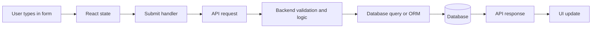

# Rishita Full-Stack Interview Rapid Review Cheat Sheet

This is the short review version of the main guide.

Target role emphasis:

- React
- Next.js
- Node.js
- C#
- full-stack feature work

Use this file for fast revision before the interview. Use the master guide for deep study.

## 1. Your Best Short Introduction

### 30-second version

"I am a full-stack developer with my strongest practical experience in React and Next.js, and I have also worked with Node.js, Express, MongoDB, PostgreSQL, and Prisma across dashboards, portals, and storefront projects. I am strongest when I can trace the full flow from UI to API to database. I also have some supporting exposure to C# application logic, so in a mixed React, Next.js, Node.js, and C# role I would contribute fastest on the frontend and full-stack application layer while continuing to deepen on the .NET side."

### 90-second version

"My strongest day-to-day experience is in React and Next.js, where I have built reusable components, dashboards, portal workflows, and storefront-style UIs. On the backend side, I have worked with Node.js and Express style REST API flows, validation logic, authentication-aware flows, and CRUD operations using MongoDB and PostgreSQL. Projects like Seminar Sidekick also gave me full-stack ownership with Next.js, PostgreSQL, Prisma, and server-side logic. My C# experience is lighter than my JavaScript and TypeScript experience, so I would not overstate it, but I understand the same backend concepts around request handling, validation, business logic, and data flow, and I am comfortable ramping in a mixed-stack environment."

## 2. What The Interviewer Is Really Checking

- Do you understand the words on your resume?
- Can you explain the full-stack flow clearly?
- Can you connect frontend, backend, and database reasoning?
- Are you honest about your real depth?
- Can you speak calmly when you do not know something exactly?

## 3. The Universal Answer Formula

For most technical questions:

1. Say what it is.
2. Say why it matters.
3. Give one example from your work.

Example:

"An API is the contract that lets the frontend and backend communicate. It matters because it separates UI from business logic and data access. In my dashboard and portal work, the frontend called REST endpoints to create, update, search, and display records."

## 4. The Most Important Full-Stack Flow To Memorize

Say this naturally:

"The frontend captures the user's input, sends it to an API endpoint, the backend validates it and applies business logic, then writes or reads data from the database and returns a response that updates the UI."

## 5. Must-Know Definitions

- **API:** contract for communication between systems
- **REST:** resource-based API style using HTTP methods
- **CRUD:** create, read, update, delete
- **State:** data a React component owns and updates
- **Props:** inputs passed into a component
- **SSR:** page rendered on the server per request
- **SSG:** page built ahead of time
- **ISR:** static page that revalidates later
- **Middleware:** code that runs in the request pipeline
- **ORM:** tool that maps code to database operations
- **ACID:** properties of reliable DB transactions
- **Authentication:** who the user is
- **Authorization:** what the user can do
- **JWT:** signed token carrying identity-related claims
- **CORS:** browser rule controlling cross-origin requests
- **CDN:** distributed network for faster content delivery
- **DTO:** object used to transfer data between layers or through APIs
- **Dependency Injection:** providing dependencies to classes instead of constructing them directly

## 6. Fast React and Next.js Answers

### What is React?

"React is a library for building reusable, state-driven user interfaces from components."

### What is Next.js?

"Next.js is a framework on top of React that adds routing, rendering strategies, API support, and production structure."

### Props vs state

"Props come from the parent. State is owned by the component. State changes trigger re-rendering."

### useEffect

"useEffect handles side effects after rendering, such as fetching data or setting up subscriptions."

### SSR vs SSG vs ISR

"SSR renders on each request, SSG builds ahead of time, and ISR is static generation with later revalidation."

### Server vs client in Next.js

"Interactivity and browser-only logic stay on the client. Secure logic, secrets, and database access stay on the server."

### What is Tailwind CSS?

"Tailwind is a utility-first CSS framework where you compose small styling classes directly in the markup for layout, spacing, typography, colors, and responsive behavior."

### Why do teams use Tailwind?

"Because it speeds up UI work, keeps spacing and layout more consistent, and fits well with component-based React and Next.js development."

### What is Sass or SCSS?

"Sass or SCSS is a CSS preprocessor that adds features like variables, nesting, and mixins to make larger styling codebases easier to organize."

### Sass vs SCSS

"SCSS uses CSS-like syntax with braces and semicolons, while Sass uses indentation-based syntax."

### Tailwind vs SCSS

"Tailwind puts styling composition into utility classes in the markup, while SCSS keeps more styling logic in stylesheet files."

### Safe honesty line if asked about Tailwind or SCSS depth

"My strongest proven styling experience is reusable responsive UI and Figma-to-code implementation, and I can apply that across standard CSS, Tailwind, SCSS, or CSS Modules depending on the team setup."

## 7. Fast Backend and Database Answers

### Node.js vs Express.js

"Node.js is the runtime. Express is a framework for building APIs and handling routes."

### What is middleware?

"Middleware is code in the request pipeline that can log, validate, authenticate, or transform requests before the final handler responds."

### What is ACID?

"Atomicity, Consistency, Isolation, Durability. It describes why transactions in relational databases are reliable."

### PostgreSQL vs MongoDB

"PostgreSQL is stronger for structured relational data. MongoDB is useful for document-shaped and more flexible data."

### What is an ORM?

"An ORM lets application code work with database models more directly instead of writing raw queries for every operation."

### What is an index?

"An index helps the database find data faster, especially for searched or filtered fields, but it also adds storage and write overhead."

## 8. Fast C# and .NET Survival Answers

### What is C#?

"C# is a strongly typed language commonly used for backend development in the .NET ecosystem."

### What is .NET?

"C# is the language. .NET is the broader platform and runtime ecosystem."

### What is ASP.NET Core?

"ASP.NET Core is a .NET framework for building web applications and APIs, including routing, middleware, and backend application logic."

### What is Entity Framework?

"Entity Framework Core is a .NET ORM, similar in purpose to tools like Prisma."

### What is LINQ?

"LINQ is a C# query style for filtering, shaping, and working with data collections more cleanly."

### What is Dependency Injection?

"Dependency Injection means classes receive what they need instead of constructing everything themselves, which improves modularity and testability."

### Best honesty line for C#

"My stronger hands-on depth is still in React, Next.js, and Node.js style full-stack work, but I understand the same backend flow concepts in a C# environment and I am comfortable ramping there."

## 9. Best Role-Targeted Positioning

Say this if needed:

"I would contribute fastest in React and Next.js feature work, API integration, UI architecture, and full-stack debugging. I am also comfortable following backend request flow in Node.js or C# style systems, and I can continue deepening further on the .NET side while contributing real product work."

## 10. Resume Examples To Use Most

### Blackeven

Use for:

- React
- Next.js
- reusable components
- multi-tenant storefronts
- shared component thinking

### Unibox

Use for:

- dashboards
- Node.js and Express style API flows
- CRUD
- debugging UI to API to DB

### Catiena

Use for:

- client portal flows
- login-protected routes
- CRUD and dashboards
- limited but real C# exposure

### Seminar Sidekick

Use for:

- full-stack ownership
- Next.js server-side logic
- PostgreSQL and Prisma
- ability to learn quickly

## 11. High-Probability Questions And Short Answers

### What is an API?

"An API is the contract that lets the frontend and backend communicate through structured requests and responses."

### How does form data reach the database?

"The frontend captures the input, sends it to an API endpoint, the backend validates it and writes it to the database, then returns a response to update the UI."

### Why not connect the frontend directly to the database?

"Because the backend protects secrets, enforces validation and authorization, and centralizes business logic safely."

### What is the difference between frontend and backend?

"Frontend is what the user interacts with. Backend handles server-side logic, security, and database access."

### What is the difference between authentication and authorization?

"Authentication is who the user is. Authorization is what that user is allowed to do."

### What is CORS?

"CORS is a browser rule controlling whether frontend JavaScript from one origin can call another origin."

### What is a transaction?

"A transaction groups multiple data operations so they succeed or fail together."

### What is a reusable component?

"A reusable component solves one UI problem clearly and can be configured by props instead of hardcoded assumptions."

### How do you debug a broken feature?

"I trace it layer by layer: UI state, network request, backend logic, and database data shape."

### How do you handle not knowing an answer?

"I do not want to bluff. My current understanding is..."

## 12. Best Answers For The C# Gap

### Why this role if C# is not your deepest stack?

"Because my strongest value is already relevant in React, Next.js, and full-stack application flow, and the backend concepts I use in Node.js transfer well to C# service development."

### Are you comfortable in a .NET codebase?

"Yes at the conceptual and practical application level. I would not claim the same depth there as in React and Next.js today, but I am comfortable following the request flow, service structure, data models, and API contracts in a C# backend."

### Why should we pick you over someone with deeper pure C# depth?

"For a mixed full-stack role, I bring strong frontend value, end-to-end API reasoning, and full-stack debugging ability immediately, while still being able to grow into the .NET side."

## 13. If You Get Confused By A Question

Use one of these:

- "Could you rephrase that once? I want to answer the exact thing you are asking."
- "Are you asking conceptually or in the context of one of my projects?"
- "I think you are asking about the frontend-to-backend flow. At a simple level..."

## 14. If You Do Not Know Something Exactly

- "I do not want to bluff that detail. My current understanding is..."
- "I have not worked deeply with that part myself, but I understand where it fits into the system."
- "I can explain the equivalent concept from the JavaScript stack, and I understand the C# version plays a similar role."

## 15. Final Night-Before Review List

Read these out loud until they feel natural:

1. Your 30-second introduction.
2. API flow from form to database.
3. React vs Next.js.
4. Node.js vs Express.js.
5. Authentication vs authorization.
6. ACID.
7. PostgreSQL vs MongoDB.
8. What you did at Blackeven.
9. What you did at Unibox and Catiena.
10. What Seminar Sidekick does end to end.
11. Your honest but confident C# positioning.

## 16. Final Reminder

Your goal is not to sound like the best C# specialist in the room.

Your goal is to sound like:

- a strong React and Next.js candidate
- a real full-stack problem solver
- someone who understands APIs and databases
- someone who can work across Node.js and ramp in C# without pretending false depth