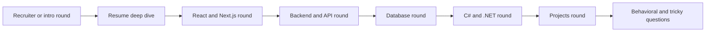

# Rishita Mock Interview Pack

This file is for practice rounds. It is not meant to be read once and forgotten.

Use it in three ways:

1. answer the questions out loud by yourself
2. ask a friend to play interviewer and use this file
3. record yourself and compare your answer to what a strong answer should include

## 1. Practice Rules

- answer in 30 to 90 seconds unless the interviewer asks for more detail
- do not jump into jargon too early
- always connect abstract concepts back to one of your projects or jobs
- if a question is unclear, ask one clarifying question instead of guessing wildly
- if a question goes beyond your real experience, be honest and answer at the conceptual level

## 2. Interview Round Map

## 3. Round 1: Intro And Recruiter Screen

### Question 1: Tell me about yourself

Strong answer should include:

- your strongest area first: React and Next.js
- your supporting backend experience: Node.js, APIs, databases
- one industry example and one academic example
- honest positioning on C#

Follow-up variants:

- Walk me through your background.
- How would you describe yourself as a developer?
- What kind of role are you looking for?

Trap to avoid:

- do not start from childhood or give a long life story
- do not hide your frontend strength as if it is a weakness

### Question 2: Why are you interested in this role?

Strong answer should include:

- the role matches your React and Next.js strengths
- it still lets you work across the stack
- you are interested in growing in mixed backend environments including C#

### Question 3: Why should we hire you?

Strong answer should include:

- strong React and Next.js value now
- real API and database understanding
- full-stack debugging ability
- honest ramp-up mindset for .NET depth

### Question 4: What are your strengths?

Strong answer should include:

- reusable component design
- full-stack feature flow understanding
- debugging across layers
- learning quickly

### Question 5: What is your biggest technical weakness?

Strong answer should include:

- deeper .NET specialization or deeper infrastructure design as growth area
- active learning approach
- no fake perfection

Trap to avoid:

- do not give a fake weakness like "I work too hard"

### Question 6: Why did you go for a Master's?

Strong answer should include:

- strengthening fundamentals
- continuing to build practical projects
- staying technical, not stepping away

### Question 7: Your last full-time role ended in 2023. What have you been doing since then?

Strong answer should include:

- Rutgers Master's
- strong GPA
- Seminar Sidekick and QueueWise
- continued full-stack learning

### Question 8: Are you more frontend or backend?

Strong answer should include:

- stronger on frontend
- but full-stack capable
- examples from Node.js, APIs, DB flow

### Question 9: Are you comfortable with C#?

Strong answer should include:

- honest current depth
- comfort with underlying backend concepts
- readiness to contribute and ramp

### Question 10: What kind of environment do you work best in?

Strong answer should include:

- collaborative environment
- clear feature ownership
- willingness to ask clarifying questions early

## 4. Round 2: Resume Deep Dive

### Question 11: What does full-stack mean to you personally?

Good answer should include:

- UI
- API
- backend logic
- DB
- end-to-end debugging

### Question 12: Walk me through one feature you built end to end

Good answer should include:

- user action
- frontend state and UI
- API contract
- backend validation and logic
- DB operation
- UI update

Best examples:

- Catiena CRUD flow
- Unibox dashboard flow
- Seminar Sidekick upload-to-answer flow

### Question 13: At Blackeven, what exactly did multi-tenant mean?

Good answer should include:

- one platform, multiple clients
- shared components
- branding or configuration differences

Follow-up variants:

- How were clients separated?
- What was shared and what was customized?

### Question 14: What shared components did you build at Blackeven?

Good answer should include:

- hero banners
- product listings
- headers and footers
- layout sections
- reason for reuse

### Question 15: What did monorepo workflow mean in your day-to-day work?

Good answer should include:

- shared packages or code
- client-specific code plus shared code
- maintainability benefit

### Question 16: What do you mean by microservice-oriented architecture?

Good answer should include:

- service boundaries or integrations
- not everything in one giant code path
- honest boundary on ownership

### Question 17: How did product data get into the storefront pages?

Good answer should include:

- frontend pages connected to backend data flows
- dynamic rendering
- product information and config

### Question 18: What did Cloudflare help with?

Good answer should include:

- deployment and delivery
- speed and edge distribution
- practical value, not fake infra depth

### Question 19: At Unibox, what kind of records and workflows were in the dashboards?

Good answer should include:

- client records
- workflow statuses
- reporting views
- internal users managing operational data

### Question 20: What did your Express routes do there?

Good answer should include:

- create
- update
- search
- display
- backend validation

### Question 21: What bugs did you debug most often?

Good answer should include:

- API response mismatches
- state updates
- DB record shape issues
- tracing layer by layer

### Question 22: At Catiena, what did the onboarding portal actually do?

Good answer should include:

- customer details
- project requests
- task status
- follow-up activity

### Question 23: Where did C# fit in at Catiena?

Good answer should include:

- basic utility and validation logic
- honest depth statement

### Question 24: What were the login-protected flows?

Good answer should include:

- authenticated access
- form behavior
- permissions-aware dashboard interactions

### Question 25: Which project on your resume best shows your current skill level?

Good answer should include:

- industry plus academic balance
- maybe Seminar Sidekick for full-stack ownership
- maybe Blackeven for production React/Next.js work

## 5. Round 3: React And Next.js Technical Round

### Question 26: What is React?

Strong answer should include:

- component-based UI
- state-driven rendering
- reusable composition

### Question 27: Props vs state

Strong answer should include:

- props from parent
- state owned by component
- state changes trigger re-render

### Question 28: Why does React re-render?

Strong answer should include:

- state or props change
- React recalculates UI

### Question 29: What is the Virtual DOM?

Strong answer should include:

- lightweight representation
- compare previous and next tree
- update only changed DOM parts

### Question 30: What is useEffect used for?

Strong answer should include:

- side effects
- data fetching
- subscriptions
- timers
- cleanup

### Question 31: Controlled vs uncontrolled components

Strong answer should include:

- controlled means React state owns value
- uncontrolled means DOM owns value
- why controlled is often easier for forms

### Question 32: What is prop drilling?

Strong answer should include:

- passing props through layers unnecessarily
- Context or state tools as solutions

### Question 33: What is Context API and when would you use it?

Strong answer should include:

- shared data without prop drilling
- good for auth, theme, language, lighter shared state

### Question 34: How do you avoid unnecessary re-renders?

Strong answer should include:

- proper state placement
- memoization where needed
- stable keys
- avoid unnecessary work

### Question 35: What makes a component reusable?

Strong answer should include:

- clear purpose
- props-driven configuration
- minimal hardcoded assumptions

### Question 36: What is Next.js and why use it instead of plain React?

Strong answer should include:

- framework on top of React
- routing
- SSR/SSG/ISR
- API routes or route handlers
- SEO and production structure

### Question 37: SSR vs SSG vs ISR

Strong answer should include:

- per request
- build time
- revalidation
- use cases

### Question 38: What is hydration?

Strong answer should include:

- attaching React interactivity to server-rendered HTML

### Question 39: Server vs client in Next.js

Strong answer should include:

- client for browser interactivity
- server for secure logic and DB access

### Question 40: What are API routes or route handlers in Next.js?

Strong answer should include:

- backend endpoints inside the Next.js app
- useful for colocated full-stack logic

## 6. Round 4: Backend, API, And Database Round

### Question 41: What is an API?

Strong answer should include:

- contract between systems
- frontend and backend communication
- structured request and response

### Question 42: Walk me through what happens when a user submits a form

Strong answer should include:

- input state
- submit handler
- request body
- backend validation
- business logic
- DB write or read
- response
- UI update

### Question 43: PUT vs PATCH

Strong answer should include:

- replace vs partial update

### Question 44: What is middleware in Express?

Strong answer should include:

- request pipeline
- validation, auth, logging, error handling

### Question 45: How do you handle errors in an API?

Strong answer should include:

- try/catch
- central error handling
- meaningful status codes

### Question 46: What is authentication vs authorization?

Strong answer should include:

- who you are vs what you can do

### Question 47: What is JWT?

Strong answer should include:

- signed token
- claims
- auth flow use

### Question 48: What is CORS?

Strong answer should include:

- browser cross-origin rule
- not replacement for auth

### Question 49: What is ACID?

Strong answer should include:

- atomicity
- consistency
- isolation
- durability

### Question 50: What is a transaction?

Strong answer should include:

- all-or-nothing group of DB operations
- example like order creation

### Question 51: PostgreSQL vs MongoDB

Strong answer should include:

- relational vs document
- structured data vs flexible document shape

### Question 52: What is an index?

Strong answer should include:

- faster queries
- storage and write tradeoff

### Question 53: What is a join?

Strong answer should include:

- combine related table data

### Question 54: What is normalization?

Strong answer should include:

- reduce duplication
- cleaner data model

### Question 55: Why use Prisma ORM?

Strong answer should include:

- type safety
- cleaner CRUD
- easier model work in app code

### Question 56: What is schema design?

Strong answer should include:

- entities
- fields
- types
- relationships
- constraints

## 7. Round 5: C# And .NET Round

### Question 57: What is C#?

Strong answer should include:

- strongly typed language
- .NET ecosystem
- backend applications and APIs

### Question 58: What is .NET?

Strong answer should include:

- platform and runtime ecosystem

### Question 59: What is ASP.NET Core?

Strong answer should include:

- web API framework in .NET
- routing, middleware, controllers, services

### Question 60: How does ASP.NET Core compare conceptually to Express?

Strong answer should include:

- both handle requests and middleware
- different ecosystems and conventions

### Question 61: What is a controller?

Strong answer should include:

- request handler grouping
- returns HTTP responses

### Question 62: What is a service layer?

Strong answer should include:

- business logic separate from controllers

### Question 63: What is a DTO?

Strong answer should include:

- data transfer shape
- API contract clarity

### Question 64: What is Dependency Injection?

Strong answer should include:

- dependencies provided from outside
- modularity and testability

### Question 65: What is Entity Framework Core?

Strong answer should include:

- ORM for .NET
- similar role to Prisma conceptually

### Question 66: What is LINQ?

Strong answer should include:

- query style for collections and data in C#

### Question 67: How comfortable are you with C# really?

Strong answer should include:

- honest current depth
- stronger JS full-stack side
- confidence in transferable backend concepts

### Question 68: How would you ramp in a .NET codebase?

Strong answer should include:

- trace request path
- understand models and services
- take small tasks first
- learn conventions while contributing

## 8. Round 6: Projects Round

### Question 69: Explain Seminar Sidekick in one minute

Strong answer should include:

- uploaded PDFs
- RAG
- Next.js
- PostgreSQL and Prisma
- grounded answers

### Question 70: Why does chunking matter?

Strong answer should include:

- relevance vs context tradeoff

### Question 71: What are embeddings?

Strong answer should include:

- numeric text representations for semantic similarity

### Question 72: What is hybrid retrieval?

Strong answer should include:

- semantic plus keyword-style signals

### Question 73: Why citation-backed responses?

Strong answer should include:

- trust and grounding

### Question 74: Was QueueWise fully backend-connected?

Strong answer should include:

- more frontend-heavy and workflow-oriented
- centralized mock integrations
- honest scope

### Question 75: What did QueueWise teach you?

Strong answer should include:

- dashboard organization
- reusable UI
- workflow-heavy state and navigation thinking

### Question 76: Why is the clinical ML project on your resume?

Strong answer should include:

- analytical thinking
- data handling
- explainability
- still secondary to full-stack identity

## 9. Round 7: Behavioral And Tricky Questions

### Question 77: Tell me about a time you learned something quickly

Best story:

- Seminar Sidekick

### Question 78: Tell me about a time you worked with unclear requirements

Best story:

- Blackeven configurable components
- Figma-to-code stakeholder translation

### Question 79: Tell me about a time you debugged a difficult issue

Best story:

- Unibox or Catiena full-stack mismatch debugging

### Question 80: Tell me about a time you worked with senior developers or cross-functional teammates

Best story:

- Catiena testing flows with senior developers
- Blackeven collaboration with design and product

### Question 81: Tell me about a time you improved consistency or maintainability

Best story:

- Blackeven shared components
- Unibox reusable UI patterns

### Question 82: What would you do if you were assigned a task in a codebase you do not understand?

Strong answer should include:

- trace one user flow first
- understand inputs and outputs
- clarify requirements early
- start with smallest working slice

### Question 83: What do you do when you do not know the answer?

Strong answer should include:

- honesty
- current understanding
- how you would verify

### Question 84: Why should we choose you over someone more experienced in C#?

Strong answer should include:

- strong React and Next.js value
- full-stack reasoning
- ability to ramp in mixed-stack systems

### Question 85: If you join and we put you on a bugfix in a .NET API on day two, what would you do?

Strong answer should include:

- understand route or endpoint
- inspect input and output
- trace service and DB flow
- ask focused questions, not broad helpless questions

### Question 86: What if we ask you to own a frontend feature that depends on a backend contract you do not control?

Strong answer should include:

- clarify contract
- align request and response shape
- handle loading and error states
- communicate dependencies early

### Question 87: What if you disagree with a teammate on implementation?

Strong answer should include:

- use reasoning and requirements
- stay collaborative
- focus on maintainability and behavior

### Question 88: What if you miss a detail in a requirement?

Strong answer should include:

- acknowledge early
- correct quickly
- improve clarification process next time

## 10. Self-Scoring Rubric

After practicing each question, score yourself from 1 to 5 on these:

- clarity
- honesty
- technical correctness
- relevance to your own experience
- calm delivery

If your answer is below 3 in any category, revisit the master guide and the resume cross-question file.

## 11. Final Mock Round You Should Practice Out Loud

Do this uninterrupted:

1. Tell me about yourself.
2. Why this role?
3. What did you build at Blackeven?
4. Explain how form data reaches the database.
5. React vs Next.js.
6. What is an API?
7. What is ACID?
8. PostgreSQL vs MongoDB.
9. Why are you a fit for a React/Next.js/Node.js/C# role?
10. Tell me about Seminar Sidekick.
11. How comfortable are you with C#?
12. Tell me about a time you debugged a difficult issue.

If you can answer those 12 smoothly, your interview readiness is much stronger.

## 12. Frontend Styling Mini Round

### Question 89: What is Tailwind CSS?

Strong answer should include:

- utility-first CSS framework
- small classes composed in markup
- common in React and Next.js apps

### Question 90: Why do teams use Tailwind?

Strong answer should include:

- faster UI building
- consistent spacing and layout
- responsive utilities built in

### Question 91: What is Sass or SCSS?

Strong answer should include:

- CSS preprocessor
- variables, nesting, mixins
- useful for larger stylesheet organization

### Question 92: What is the difference between Sass and SCSS?

Strong answer should include:

- SCSS is CSS-like syntax
- Sass uses indentation syntax

### Question 93: Tailwind vs SCSS, how would you compare them?

Strong answer should include:

- Tailwind utility classes in markup
- SCSS stylesheet-based organization
- both solve styling problems in different ways

### Question 94: What if our codebase uses Tailwind and your background is more regular CSS or SCSS?

Strong answer should include:

- frontend fundamentals transfer
- layout, spacing, responsiveness, accessibility still matter
- Tailwind mainly changes expression and organization of styles

### Question 95: How does responsive styling usually work in Tailwind?

Strong answer should include:

- breakpoint prefixes like `sm:`, `md:`, `lg:`
- different utilities applied at different screen sizes

### Question 96: When would you prefer SCSS over Tailwind?

Strong answer should include:

- team prefers stylesheet organization
- mixins, variables, and nested style structure are helpful
- not every team wants utility-heavy markup

### Question 97: What are CSS Modules?

Strong answer should include:

- locally scoped CSS classes
- familiar CSS syntax
- useful for component-based apps

### Question 98: What are styled-components?

Strong answer should include:

- CSS-in-JS approach
- component-scoped styles in code
- dynamic theming or prop-driven styling

### Question 99: What is Material UI and when would you use it?

Strong answer should include:

- React component library
- prebuilt accessible components
- useful for dashboards and enterprise apps needing fast consistency

### Question 100: What is Bootstrap and when would you use it?

Strong answer should include:

- CSS framework
- responsive grid and utilities
- fast layout work when highly custom styling is not the main goal

### Question 101: How would you choose between Tailwind, CSS Modules, styled-components, Material UI, Bootstrap, or SCSS?

Strong answer should include:

- existing codebase and team conventions first
- product type matters
- tradeoff between speed, customization, and maintainability

### Question 102: What would you do if you joined a project that already used a styling system you would not personally choose?

Strong answer should include:

- respect consistency first
- learn the existing system
- change only if there is a real product or maintenance reason